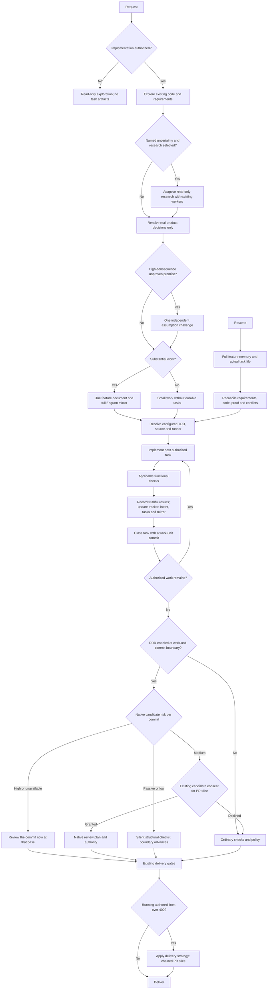
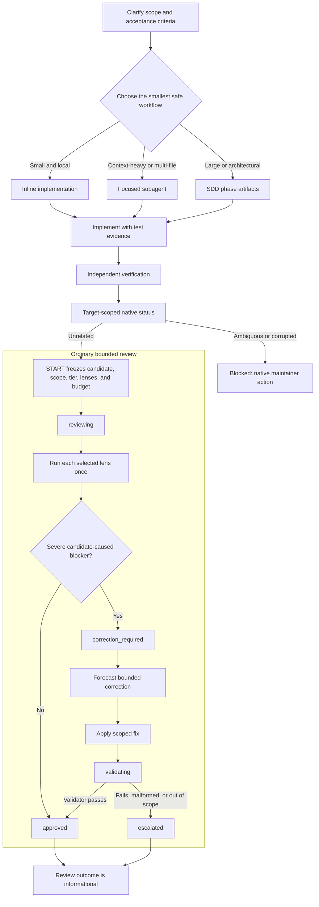

# README technical reference

This reference preserves the detailed installation, configuration, ODD, optional SDD/OpenSpec, runtime, and contributor material previously carried by the README. Start with the [README](../README.md) for the product overview; use this document when you need operational detail. Historical compatibility and authority passages remain reference material, not newly endorsed operator instructions.


## Organic Driven Development

Organic Driven Development (ODD) keeps explore → implement → proportionate checks as the everyday default, while explicitly selected SDD remains separate. For substantial authorized implementation, the parent automatically tracks feature progress after exploration, without asking for task-tracking or storage permission. Small, understood work creates no durable task artifact; investigation and proposal-only work stay read-only.

Choose SDD explicitly when you want separate proposal, spec, design, tasks, and verification artifacts. Its phases and handoffs add coordination; everyday work usually needs the intent and evidence, not that extra workflow. ODD keeps those in one document. Size, ambiguity, and risk alone never select SDD.

### The ODD protocol

ODD is the predefined workflow: it runs by default on every request, without the user asking for a workflow, a plan, or task tracking. SDD is a branch inside ODD, entered only by an explicit request or an accepted proposal.

1. **Authorize** — read-only unless implementation is authorized; ask one clarification when intent is ambiguous.
2. **Explore** — read existing code and requirements first, proportionately to the request.
3. **Resolve uncertainty** — optional research or one focused product question only for a real unresolved decision.
4. **Classify** — substantial when exploration yields two or more meaningful implementation steps; small work stays small.
5. **Track before the first write** — create the feature document and Engram mirror automatically for substantial work, and tell the user in one line.
6. **Implement task by task** — route each task through the smallest safe workflow, with configured TDD and applicable checks. Every task closes with at least one work-unit commit on the feature branch (branch first when on the default branch), with tests and docs alongside the behavior, using a Conventional Commit message; the feature document records the commit identity as evidence.
7. **Close** — report the verified outcome, failed/pending checks, and the next step. The native review candidate is a work-unit commit or a PR slice, never a TODO checkbox and never the accumulated feature branch.

- **One feature document:** `odd/tasks/<feature-name>.md` holds objective, problem, why, scope, constraints, actionable checklist with stable IDs and acceptance criteria, verification evidence, progress, and next step. Project-scoped Engram topic `odd/<feature-name>/tasks` mirrors the full document and repository-relative locator. Keep concise rationale for meaningful accepted changes here, not a separate plan or exhaustive journal. Accepted user, review, or verification changes update intent and tasks together; preserve valid completed work, add new tasks or reopen invalidated items with reasons. Findings alone do not authorize expansion or acceptance. Routine corrections stay with their tasks; checkoffs require observed proof.
- **Recovery:** write local progress first and read back both copies; writes are not atomic. Unavailable Engram leaves an explicit pending mirror, not invented success or a block on unrelated safe work. Before implementation or resume, the parent reads full feature memory and the actual task file, reconciles code and evidence, and preserves conflicting versions. Pass the locator and relevant context; workers read the document before edits. The existing Todo UI is a projection, not another authority.
- **Task size:** about 400 authored changed lines (additions plus deletions) is advisory only, not a cap, acceptance criterion, automatic stop, forced split, or RDD trigger. Keep coherent behavior with tests and docs, explain natural overages, and continue under existing PR policy. Forward this instruction to workers; never remove whitespace, comments, or tests, minify, invent abstractions, or split artificially for cosmetic savings.
- **Delegation boundary:** the parent delegates implementation touching two or more non-trivial files; a second direct path alone is not a runtime refusal. The runtime cannot infer whether an edit is mechanical from write history. Validate consequential premises before building, reuse relevant sibling findings, run focused checks while iterating, then the applicable full suite at closure. This is effort guidance, not a hard token or line budget.
- **Research:** optional research addresses a named uncertainty. Establish problem, intended outcome, constraints, and current evidence; inspect code and adapt depth to consequence, not fixed questionnaires or rounds. The parent asks one focused product question only when needed, then waits; workers return gaps. Use available authorized documentation/web tools, prefer primary sources, and attribute claims to URLs/code locations. Distinguish facts, assumptions, contradictions, freshness, and gaps; return a recommendation, tradeoffs, open questions, and implementation implications. Forward these instructions to an existing fresh general worker, not a specialized agent or `sdd-research`. Unavailable evidence pauses only unsafe dependent decisions. Research stays read-only with no new persistence/readiness machinery; a brief proposal is needed only for a real decision.
- **Assumptions:** at most one scoped independent read-only challenge for a high-consequence unproven premise, including a small security-critical change. Deterministic failures need fixes, not debate. Native RDD claims stay with its refuter.
- **TDD:** resolve on/off from existing project/session configuration or explicit user choice; retain source and exact runner in the feature document when present and forward all three on every implementation delegation, refreshing on resume. Test presence does not enable TDD. Enabled requires observed RED before implementation → GREEN → REFACTOR; disabled still requires ordinary functional checks. Unknown/conflicting mode or a missing runner needs only the clarification affecting the next action, never invented precedence, commands, or `sdd-init`.
- **Checks:** functional checks run per task; a TODO checkbox never triggers a review cycle. The native review candidate is a work-unit commit or a PR slice, never a TODO checkbox and never the accumulated feature branch. After each work-unit commit, when RDD is enabled, assess it with `gentle_review` `{"operation":"assess"}` and `{"baseRef":"<last reviewed boundary>","committedOnly":true}`. Passive or low stays silent and the boundary advances. High, or an unavailable or failed assessment, reviews the commit itself right away at that base. Medium defers to the PR slice, the commits accumulated since the last reviewed boundary, bounded by the delivery budget of about 400 authored changed lines, and reviews at slice close. The first boundary is the branch point, and every reviewed boundary becomes the next base. Record the assessed tier and outcome per task: granted, declined, passive, deferred to slice, or unavailable. Existing risk, consent, and authority stay unchanged; never infer low risk from a failed assessment. Never skip an existing delivery gate.
- **Delivery:** at feature-document creation, forecast authored changed lines (additions plus deletions, generated files excluded) from the task list, and keep a running count from work-unit commits. Choose one delivery strategy per feature: `ask-on-risk` (default), `auto-chain`, `single-pr`, or `exception-ok`. When the forecast or running count exceeds about 400 authored changed lines, apply the chosen strategy before the next commit. `ask-on-risk` asks once for the chain strategy (`stacked-to-main` or `feature-branch-chain`); `auto-chain` asks only for a missing chain strategy and slices automatically. Cache both choices, and record slice boundaries (which commits each PR holds) in the feature document. Resolve the `work-unit-commits` and `chained-pr` skills by registry name before planning or creating any PR.



This is guidance through existing tools, not a new CLI, phase, state engine, or execution harness. Static prompt tests and scripted hook checks prove instruction delivery, not autonomous model adherence; actual create/update/resume behavior requires observed Pi sessions.

## Navigation

- [Capabilities](#capability-reference)
- [Installation and release policy](#install)
- [ODD workflow and recovery](#organic-driven-development)
- [Optional SDD/OpenSpec and review architecture](#sddopenspec-flow)
- [Configuration, commands, skills, memory, and telemetry](#persona-modes)
- [Package contents and development](#package-contents)

## Capability reference

| Capability                     | What it does                                                                                                                                  |
| ------------------------------ | --------------------------------------------------------------------------------------------------------------------------------------------- |
| **el Gentleman persona**       | Makes Pi behave like a senior architect and teacher, not a generic chatbot. Spanish responses use Rioplatense voseo by default; neutral mode is saved globally with project overrides. |
| **Configurable startup intro** | Adds a rose/text-logo startup intro, compact runtime panel, color presets, and commands to hide or show the decorative parts.                  |
| **Work routing discipline**    | ODD keeps small tasks inline and delegates context-heavy work. SDD is explicitly selected when its formal artifacts are wanted, not because of size or risk.                          |
| **SDD/OpenSpec assets**        | Installs phase agents and chains for `init`, `onboard`, `explore`, `proposal`, `spec`, `design`, `tasks`, `apply`, optional `verify` and `archive`. |
| **Lazy SDD preflight**         | Confirms SDD mode, artifact store, delivery strategy, and review budget on the first SDD invocation of every interactive session, including saved preferences; the parent transports the confirmed block to RPC SDD children.              |
| **Subagent orchestration**     | Keeps one parent session responsible while child agents explore, implement, test, or review with focused context.                             |
| **Strict TDD support**         | TDD mode, source, and runner come from configuration or explicit choice in ODD and SDD. Enabled TDD requires observed evidence; a test command alone does not enable it.                   |
| **Closed choice prompts** | Per-option hover/click/wheel in fullscreen; keyboard selection in either TUI mode. |
| **Native pointer regions** | Compose hover, press, click, and wheel behavior around public TUI components. |
| **Agent overlay close control** | Adds a header close button that adapts to available width. |
| **Reviewer protection**        | Surfaces review workload risk before a task turns into an oversized PR.                                                                       |
| **Per-agent model assignment** | Pi-native modal for assigning stronger or cheaper models to specific SDD/custom agents.                                                       |
| **Skill discovery registry**   | Maintains `.atl/skill-registry.md` from project and user skills so review/comment/PR workflows do not silently miss the right skill.          |
| **Skill creation workflow**    | Provides the `gentle-ai-skill-creator`/`gentle-ai-skill-improver` skills, `/skill-creation` prompt, and packaged style guide for LLM-first skills. |
| **Delivery skills**            | Includes issue-first PRs, chained PRs, work-unit commits, cognitive docs, comment writing, and Judgment Day review.                           |
| **Bounded native review**      | Freezes one candidate, dispatches only controller-selected lenses, and records native authority. Review outcomes are informational; delivery follows ordinary repository policy. |
| **Verified native runtime**    | The current source checkout provisions the exact package-local Gentle AI v3.7.0 runtime: signed, SHA-256-pinned release archives on Darwin/Linux and a Go SumDB-verified source build on Windows x64/arm64. It validates package-local integrity and rejects PATH, global, sibling, symlink, and mode fallbacks. |
| **Runtime safety**             | Blocks destructive shell commands, asks for confirmation for sensitive operations, and blocks direct read/write/edit access to sensitive paths. |

## Native pointer regions

Compose pointer behavior around public `Text`, `Box`, or custom content without making it a keyboard target:

```ts
const scope = createNativePointerScope();
const openInput = scope.wrap(new Text("Open input", 0, 0), {
  onClick: () => {
    openInputEditor();
    return { handled: true };
  },
});
const panel = new Container();
panel.addChild(openInput);
const observer = scope.createMouseObserver(() => tui.requestRender());
```

Pass `observer` around the root's native mouse dispatch; reuse `panel` as custom or overlay content.
Pointer input is fullscreen-only. Regions preserve a consuming child's native result and do not focus
`Text`, activate on press or wheel, synthesize outside leave events, or alter terminal tracking.
Callers own keyboard policy, theme state, and business actions.

**Migration note:** Do not enable `pi-tool-cards` and `quiet-tools` together: Pi rejects duplicate `bash`, `read`, `edit`, and `write` registrations. Disable or remove the standalone package during migration; gentle-pi does not change those package registrations or delete that repository. The global fullscreen setting described below is a separate install-time change.

## Install

Two paths reach the same package. Path A stays standalone; Path B installs into an existing pi.

### Path A: standalone `gentle-shell` (recommended, no pi changes)

```bash
npm i -g gentle-pi

# Own home, never touches your pi install
gentle-shell

# Reuse your pi sign-ins, models and chats instead
gentle-shell --link
```

`gentle-shell` alone starts in its own home, `~/.gentle-shell/agent`. `gentle-shell --link` reuses `~/.pi/agent` as-is. Run `gentle-shell home link` to make `--link` the default. Full flags, env vars, and modes: [gentle-shell launcher](#gentle-shell-launcher).

### Path B: inside an existing pi

```bash
pi install npm:gentle-pi
```

This installs the current npm release; select an explicit version if you need a reproducible pin. Restart Pi after installation, then run `gentle-ai sync`. Check the [published releases](https://github.com/Gentleman-Programming/gentle-shell/releases) for version-specific runtime and provider-contract pairing.

### Source checkout

This checkout declares `gentle-pi` `3.7.0` with a package-local Gentle AI `v3.7.0` pin. Checkout metadata alone is not proof of npm publication; verify the registry version and its release workflow.

The native SDD status consumer accepts both the pinned producer's legacy
`apply`/`verify`/`remediate`/`archive` instruction record and the classical
`apply`/`verify`/`archive` record. It preserves the provider's instructions and
selected route; it does not fabricate a remediation phase for a newer producer.
Unknown or incomplete instruction records still fail closed.

The Pi runtime now uses native status exclusively for SDD and retires standalone
sync. The full chain follows completed apply to archive, where applicable delta
specs are composed; verification remains explicitly invokable. With the current
3.7.0 pin, native still requires verification and its emitted evidence requirements;
a plain practical PASS report does not satisfy that legacy native gate. Pi forwards
those exact instructions without overriding readiness or inventing legacy evidence.
Classical direct-archive behavior is compatibility-tested with an identified
upstream development build, not presented as a published fix or version bump.
The complete classical flow awaits a compatible published native version; this
change does not bump the pin. Ordinary attempt governance and research/planning simplification remain separate
work under [SDD parity #1051](https://github.com/Gentleman-Programming/gentle-shell/issues/1051).

### Pi compatibility

The current package requires Pi 0.85.1 or newer (development tests pin 0.85.1). Use the latest Pi release; gentle-pi does not update your installed Pi automatically. Children, including any `GENTLE_PI_AGENTS_PI` override, must emit `agent_settled`: `agent_end` records a run's output but is not completion because retries or queued continuations may follow.

The [`v2.6.0` release](https://github.com/Gentleman-Programming/gentle-shell/releases/tag/v2.6.0) added persistent registered worktrees and grouped `/gentle:changes` views; fuller workspace interaction details are in the [Gentle Shell reference](gentle-shell.md). It also adds named atomic `/gentle:profiles`, parent-confirmed native SDD preflight transport, native review intended-untracked selection and provider continuations, and opt-in custom ask responses. Pi recognizes its global Git-managed package path; subsystems install with explicit recovery guidance when npm lifecycle work was skipped. Windows keeps child consoles hidden and fixes ownership mode; Gentle Todo keeps the next pending task visible when collapsed.

### Install-time fullscreen

A successful postinstall in Pi's **global npm-managed** `agent-home/npm/node_modules/gentle-pi` or exact **global Pi Git-managed** `agent-home/git/github.com/Gentleman-Programming/gentle-pi` installation persists `"tuiMode": "fullscreen"` in `agent-home/settings.json`, preserving other settings. Agent home resolves through `GENTLE_PI_AGENT_HOME`, then `PI_CODING_AGENT_DIR`, then `~/.pi/agent`. Use `/settings` to switch back to regular; rerunning a recognized postinstall resets it to fullscreen. Existing project overrides still take precedence.

Project-local installs (`pi install -l`), Git installs outside that exact global Pi path, local-path installs, temporary packages, development checkouts, ordinary npm consumers, and pnpm symlink-store packages do **not** receive this change. Updates or installs that do not execute postinstall cannot reassert it; this is not a universal install/update guarantee or a change to historical releases.

Malformed/nonobject JSON, symlink/nonregular settings, unsafe paths, or a busy settings lock fail without replacing settings. The installer coordinates with Pi's cooperative settings lock and uses atomic replacement; it does not guarantee safety against noncooperating writers or malicious concurrent directory replacement. Already-fullscreen settings remain byte-identical. Native installation failure leaves settings untouched; `GENTLE_PI_SKIP_GENTLE_AI_INSTALL=1` skips only native provisioning, not the recognized global fullscreen setting.

### RDD history and opt-in

Native RDD was introduced in `gentle-pi` `v0.15.0` on 2026-07-10 with bounded review transactions. The current stable release, [`v3.5.1`](https://github.com/Gentleman-Programming/gentle-shell/releases/tag/v3.5.1), includes native RDD:

```bash
# Stable release
pi install npm:gentle-pi@3.5.1
```

RDD remains opt-in. Enable it only through an explicit user decision with `/gentle:review-mode enable`; `status` lets you inspect the mode without changing it.

The source checkout's RDD integration installs Gentle AI only into its private `.gentle-ai/` directory. Darwin and Linux use pinned release assets with asset and executable SHA-256 verification (signed archives for source pin `v3.7.0`; raw prerelease binaries only under a prerelease pin). Windows x64 and arm64 build the exact `v3.7.0` source tag with a local Go 1.25.10+ toolchain, a sealed Go environment, `GOTOOLCHAIN=local`, and `GOSUMDB=sum.golang.org`; it does not download Go automatically. Windows provenance is Go-toolchain plus SumDB evidence and postinstall tamper detection, **not** Authenticode or protection against a malicious joint binary-and-manifest replacement. Package-private locks coordinate cooperative concurrent or crashed installers; their tombstones fail closed. A malicious same-user process with write access to package-private `node_modules` is outside that protocol because it can already replace package code, binary, or manifest, and portable Node has no pathname-delete CAS. It never uses `PATH` or a global `gentle-ai` installation. For development or offline installs only, set `GENTLE_PI_SKIP_GENTLE_AI_INSTALL=1`; native review operations then fail closed with an actionable `package-local-binary-missing` error. To recover explicitly, if `GENTLE_PI_SKIP_GENTLE_AI_INSTALL` is set, remove or unset it before changing to the installed `gentle-pi` package directory. Then run `node scripts/install-gentle-ai.mjs`. This invokes the package-owned installer without relying on a global binary or npm configuration change. A missing binary can result from skipped lifecycle scripts, but does not prove that lifecycle scripts were disabled.

Recommended companion packages, into the standalone `gentle-shell` home:

```bash
gentle-shell install npm:pi-intercom
gentle-shell install npm:gentle-engram
gentle-shell install npm:pi-web-access
gentle-shell install npm:pi-lens
gentle-shell install npm:@juicesharp/rpiv-ask-user-question
```

`--link` before the subcommand (for example `gentle-shell --link install npm:pi-intercom`) targets `~/.pi/agent` instead of the isolated home.

Or, when `gentle-pi` is installed inside an existing pi:

```bash
pi install npm:pi-intercom
pi install npm:gentle-engram
pi install npm:pi-web-access
pi install npm:pi-lens
pi install npm:@juicesharp/rpiv-ask-user-question
```

Then start Pi in a project:

```bash
pi
```

`gentle-pi` installs delegation and review agents at startup. SDD agents, chains, and support are global Pi runtime assets installed on demand, not per-project setup. The first SDD flow in a session runs a one-time SDD preflight for preferences and managed-asset refresh; natural-language SDD requests or accepted proposals select that workflow, then run its preflight. Ordinary ODD does not run SDD initialization.

### Base references for review

An explicit `baseRef` accepts one of these forms:

- `HEAD`.
- A full 40- or 64-character commit id.
- A ref name: a branch, a tag, a remote-tracking ref, or an explicit `refs/...` path.

Abbreviated commit ids are rejected as `base-ref-unresolvable`; a rejected `baseRef` names its accepted forms in the response. Explicit tree ids are not accepted today.

Under the ODD contract, the orchestrator passes the last reviewed boundary as `baseRef` for each work-unit commit or slice, so base refs are routine input, not an edge case.

An orphan branch with commits and no parent has no branch point to name as `baseRef`. Before the first work-unit commit, either:

- Create an empty root commit to open the branch: `git commit --allow-empty -m "chore: open the feature branch"`. The next commit can then use that root commit as its `baseRef`.
- Omit `baseRef` while the branch is still unborn (no commits yet); the review uses Git's empty tree as the base automatically.

## gentle-shell launcher

`gentle-shell` (installed by `npm i -g gentle-pi`, exposed as the package's `bin`) opens pi with the Gentle Shell package loaded, without installing it into your pi agent or touching its `settings.json`. It is a thin `bin/gentle-shell.mjs` wrapper around the pure, unit-tested `lib/gentle-shell-launcher.ts` (built to `runtime/gentle-shell-launcher.mjs`); the wrapper owns process, filesystem, and child-process wiring only.

```bash
gentle-shell [options] [-- pi-args...]
gentle-shell home [link|isolated|<path>]
gentle-shell [home selectors] setup [--dry-run]
```

### Flags

| Flag | Effect |
| --- | --- |
| `--link` | Home is `PI_CODING_AGENT_DIR` or `~/.pi/agent`. Reuses your existing pi sign-ins, models, and chats; never writes to its `settings.json`. |
| `--isolated` | Home is `GENTLE_SHELL_HOME` or `~/.gentle-shell/agent`. No credential seeding. Default when nothing else is configured. |
| `--home <path>` | Home is the given directory. |
| `--package-root <dir>` | Force this directory as the gentle-pi package to load, taking over from any conflicting package the target `settings.json` already declares (see "Loading the package" below). |
| `--help`, `-h` | Print usage (flags, commands, env vars) and exit 0. |
| `--version` | Print `gentle-shell <version>`, `pi <version>`, and `home <mode> <dir>`, then exit 0. |
| `--` | Everything after is forwarded to pi verbatim, even text that looks like a `gentle-shell` flag. |

`--link`, `--isolated`, and `--home` are mutually exclusive; combining two is a usage error, as is `--home` or `--home=` with an empty value. Effective-home precedence: an explicit flag wins, then the persisted `home` subcommand choice, then the `--isolated` default. Every argument gentle-shell does not recognize — `--mode rpc`, `-p "..."`, etc. — is forwarded to pi unchanged.

### `home` subcommand and `~/.gentle-shell/config.json`

`gentle-shell home` alone prints the effective mode and directory (`<mode> <dir>`) without persisting anything. `gentle-shell home link`, `gentle-shell home isolated`, or `gentle-shell home <path>` persists that choice to `~/.gentle-shell/config.json` as `{"home": "link" | "isolated" | "<path>"}`, so a later plain `gentle-shell` picks it up; a flag on a given invocation still overrides the persisted config without rewriting it.

### Managing packages

`gentle-shell install npm:<pkg>`, `gentle-shell remove ...`, `gentle-shell list`, `gentle-shell update ...`, `gentle-shell config`, and `gentle-shell auth ...` run pi's own commands against the resolved home — the `--isolated` home by default, or your own pi home with `--link`. A launcher flag before the subcommand (`--link`, `--isolated`, `--home <path>`) still selects which home the subcommand runs against. Running `gentle-shell install npm:gentle-pi` inside the isolated home is unnecessary: the launcher already loads the Gentle Shell package itself (see "Loading the package" below).

`gentle-shell update` and `gentle-shell list` follow that same home selection, so they inspect and update packages in whichever home the effective flag or persisted `home` config points to.

### `setup` subcommand

`gentle-shell setup` provisions the resolved home — the same home selection as any other invocation, `--isolated` by default, or `--link`/`--home <path>` when given before `setup` — with the same companion packages a regular `gentle-ai install --agent pi` installs into a Pi agent home: `npm:gentle-pi`, `npm:gentle-engram`, `npm:pi-mcp-adapter`, `npm:@juicesharp/rpiv-ask-user-question`, `npm:pi-web-access`, `npm:pi-btw`, plus running `pi-engram init`. It never touches `~/.pi/agent` unless you pass `--link`.

It resolves the home and the pi runtime exactly as a normal run does (including the isolated/`--home` bootstrap and the pi version gate), then runs the package-local pinned gentle-ai binary — `gentleAiBinaryPath()` from `lib/gentle-ai-binary.ts`, never a `gentle-ai` found on `PATH` — as:

```bash
<package>/.gentle-ai/v<version>/gentle-ai install --agent pi --scope global [--dry-run]
```

with `PI_CODING_AGENT_DIR` and `GENTLE_PI_AGENT_HOME` set to the resolved home, and the resolved pi runtime's directory prepended to `PATH`, so gentle-ai's own preflight finds `pi` even when it is bundled or given through `GENTLE_SHELL_PI`. `--dry-run` is forwarded to gentle-ai unchanged. Output streams straight through (`stdio: "inherit"`), and `gentle-shell setup` exits with gentle-ai's own exit code. If the package-local gentle-ai binary is missing, `setup` installs it itself (by running its own `scripts/install-gentle-ai.mjs` postinstall) before giving up — the postinstall never runs when `npm install`'s lifecycle scripts were disabled (for example under `ignore-scripts=true`) — unless `GENTLE_PI_SKIP_GENTLE_AI_INSTALL=1`, in which case it exits 1 with the same actionable message it always did.

Requires the package-local gentle-ai pin at v3.6.0 or newer — the pin that adds `PI_CODING_AGENT_DIR` support to `gentle-ai install`. `setup` enforces this before spawning anything: an older pinned gentle-ai ignores that variable and would silently install into `~/.pi/agent` instead of the target home, so `setup` exits 1 with `gentle-shell: setup needs the package-local gentle-ai v3.6.0 or newer (pinned: <version>); this build cannot provision a home without touching ~/.pi/agent` instead of spawning it.

gentle-ai's managed Pi stack always declares `npm:gentle-pi` itself in the home's `settings.json` as part of that install. Once gentle-ai exits 0, `setup` removes it again immediately: this launcher always loads its own gentle-pi (its own package root, or a take-over — see "Loading the package" below), never the one gentle-ai's stack just installed, so leaving that declaration in place would let the home drift onto whatever gentle-pi npm last installed — or, for a developer running from a source checkout, onto the published npm package — instead of the running launcher's own copy. `setup` removes `npm:@juicesharp/rpiv-ask-user-question` only when `<resolved Pi agent home>/gentle-ai/question-owner.json` contains exactly `{ "version": 1, "owner": "gentle-pi", "enabled": true }`: only then may gentle-pi's first-party `ask_user_question` replace the external provider. Missing, disabled, malformed, unreadable, or extra-key documents preserve the external provider; `npm:gentle-pi` is still removed independently. `--dry-run` reports the external removal only with that enabled owner, and always reports the possible `npm:gentle-pi` removal, without running either. A home only ever keeps a `npm:gentle-pi` declaration — and so only ever stops getting the launcher's own injection (see "Loading the package" below) — when something puts it back after `setup` runs: a hand-edited `settings.json`, or `gentle-shell install npm:gentle-pi` run manually; in that case the home behaves like a regular Pi agent home with gentle-pi installed, and `gentle-shell update npm:gentle-pi` updates it like any other package.

**Known limitation**: gentle-ai always writes its persona file to the shared `~/.pi/gentle-ai/persona.json` without honoring `PI_CODING_AGENT_DIR`, so the persona is shared across every home `gentle-shell setup` provisions, not per-home. `setup` keeps that file byte-identical across the run regardless — snapshotting it before spawning gentle-ai and restoring it afterward, in manual, `--dry-run`, and automatic first-run modes alike — because the pinned gentle-ai still writes the Pi persona outside `PI_CODING_AGENT_DIR`. gentle-ai also records the running binary's managed-asset digest in the shared `~/.gentle-ai/state.json` (`managed_asset_digest`), again regardless of `PI_CODING_AGENT_DIR`, so a `setup` run otherwise leaves the user's own (unrelated, on-`PATH`) gentle-ai reporting its managed assets as outdated and demanding `gentle-ai sync`. `setup` restores just that one field afterward, the same way and in the same modes — but never the whole file, since `state.json` also carries fields (like the installed-agents list) the pinned gentle-ai is meant to update, and it never creates or deletes `state.json` itself.

**Test/development only**: `GENTLE_SHELL_GENTLE_AI_BIN` overrides which gentle-ai executable `setup` runs, bypassing the pinned package-local resolution. `GENTLE_SHELL_GENTLE_AI_PIN` overrides the pin version `setup` (and automatic first-run provisioning, below) checks against `MIN_SETUP_GENTLE_AI_VERSION` (3.6.0), independent of `GENTLE_SHELL_GENTLE_AI_BIN`. `GENTLE_SHELL_GENTLE_AI_INSTALLER` overrides the script path `setup` runs to self-heal a missing package-local binary, instead of the real `scripts/install-gentle-ai.mjs`. `GENTLE_SHELL_CONFIG` overrides the launcher config.json path (normally `<homedir>/.gentle-shell/config.json`), read and written by the `home` subcommand and by automatic first-run provisioning's marker. `GENTLE_SHELL_AUTO_SETUP_TIMEOUT_MS` overrides automatic first-run provisioning's 15-minute per-child timeout ceiling (manual `setup` never has one). All five exist for the test suite and for exercising a different gentle-ai build/pin/installer/config/timeout; end users never need them.

**Where the plugin list comes from**: the companion list above is not maintained in gentle-shell itself — it is the managed Pi stack of the pinned package-local gentle-ai (gentle-ai's own managed sources, plus whatever it has already retired). Over time, third-party plugins in that stack get replaced by native Gentle Shell features — already done for `rpiv-todo` and `npm:@juicesharp/rpiv-ask-user-question` — so a gentle-ai release retires a plugin, gentle-pi bumps its pinned gentle-ai version, and the next `gentle-shell` launch sees the pin change (see "First run in an isolated or custom home" below), re-runs the setup flow, and gentle-ai prunes the retired package from the home. `gentle-shell`'s owner-gated post-install removal of `npm:@juicesharp/rpiv-ask-user-question` above is a stopgap for homes provisioned before that gentle-ai retirement ships.

### pi runtime resolution

1. `GENTLE_SHELL_PI` — path to a pi executable, when set to a non-empty value.
2. The bundled `@earendil-works/pi-coding-agent` resolved next to gentle-pi (`dist/bundle/cli.js`, run with the current `node`), when installed as its optional peer dependency.
3. `pi` on `PATH`.

If none resolve, `gentle-shell` exits 1 naming all three options. Once a runtime is found, its `pi --version` must be at least `0.85.1` (the pinned peer minimum): an older version exits 1 naming the found and required versions, and unparsable `--version` output exits 1 naming the required minimum.

### Environment variables

| Variable | Effect |
| --- | --- |
| `GENTLE_SHELL_PI` | Overrides pi runtime resolution (see above). |
| `GENTLE_SHELL_HOME` | Overrides the isolated home directory (default `~/.gentle-shell/agent`). |
| `PI_CODING_AGENT_DIR` | Read to resolve the `--link` home; also set on the pi child process to the effective home. |
| `GENTLE_PI_AGENT_HOME` | Set on the pi child process to the effective home; gentle-pi's own home resolution reads it back. |
| `GENTLE_SHELL_NO_AUTO_SETUP` | Set to `1` to skip automatic first-run provisioning (see "First run in an isolated or custom home" below). |

### Loading the package

Unless the target home's `settings.json` already declares gentle-pi, every invocation injects `-e <package root> --theme <root>/themes --skill <root>/skills --prompt-template <root>/prompts` ahead of the forwarded arguments, so the Gentle Shell extensions, themes, skills, and prompt templates load without a separate `pi install`. Every mode — `--link`, `--isolated`, and `--home <path>` — consults the home's own `settings.json` for a declaration; an isolated or `--home` home only ever carries one by running `gentle-shell setup` (see above), which installs `npm:gentle-pi` into it, or by hand-editing `settings.json`. A home without any declaration always gets the plain injection — except when the forwarded arguments start with one of pi's own subcommands (`install`, `remove`, `uninstall`, `update`, `list`, `config`, `auth`): pi dispatches those on `argv[0]` before it parses any flags, so the injection — and any take-over below — is skipped entirely and pi sees the bare subcommand, e.g. `gentle-shell install npm:x` runs exactly `pi install npm:x`. A subcommand never triggers a take-over, even against a home whose settings declare a conflicting gentle-pi; see "Managing packages" above.

A declaration is recognized either as `npm:gentle-pi[@version]` in the `packages` array, or as a local path package (string or `{"source": "..."}` entry, relative or absolute) whose own `package.json` names it `"gentle-pi"` — the shape produced when gentle-pi is developed from a checkout and referenced by path in `settings.json` instead of installed via `pi install npm:gentle-pi`.

- **A pi subcommand as the first forwarded argument**: no injection and no take-over at all, regardless of any declaration — pi must see the bare subcommand as `argv[0]`.
- **npm declaration matching this launcher's own install**: no injection — pi already loads gentle-pi from the declared package.
- **No declaration at all, or a path declaration that resolves (after `realpath`) to this launcher's own package root**: the same plain injection as above.
- **A declaration that resolves to a *different* gentle-pi** (a different checkout declared by path, for example) **— take-over**: `gentle-shell` prints `taking over gentle-pi from <declared source> for this run (settings unchanged; its skills, prompts, and themes still load alongside this launcher's)` to stderr, then runs pi with `--no-extensions` followed by an explicit `-e <dir>` for every *other* package already in settings (npm entries resolve to `<agent dir>/npm/node_modules/<name>`; path entries resolve relative to the settings file), then loose extension entries for `<agent dir>/extensions` and the project-local `<cwd>/.pi/extensions` (each candidate directory only consulted when it already exists), and finally its own `-e <package root> --theme ... --skill ... --prompt-template ...`. `settings.json` itself is never modified, and every `-e` path — including the launcher's own package root — is injected at most once even if it would otherwise repeat.

  A declared *other* package whose resolved directory does not actually exist (a hand-edited `settings.json`, a failed or interrupted `pi install`, or an npm store laid out anywhere other than `<agent dir>/npm/node_modules`) is skipped with a stderr warning naming the source and the resolved path, instead of being handed to pi as an unresolvable `-e` that would fail the whole launch with "Cannot find module".

  `--no-extensions` disables pi's normal directory-discovery pass, and pi's `-e` flag hands a path straight to its module loader with no discovery of its own — passing a loose extensions directory as-is via `-e <dir>` fails with "Cannot find module" unless that directory is itself a self-contained extension. So each loose candidate directory is resolved before injection: a directory that is itself a self-contained extension (a `package.json` declaring a `pi.extensions` manifest) is passed through as a single `-e <dir>`; otherwise its direct `*.ts`/`*.js`/`*.mjs` files — including a root-level `index.ts`/`index.js`, which is just another loose file — and any `<subdir>/index.ts`/`index.js` are discovered individually — mirroring pi's own directory scan — and each is injected as its own `-e <file>`. Hidden entries (dotfiles) and `*.d.ts` declaration files are skipped, since neither was ever a runnable extension.

  A git-sourced other package is skipped with a stderr warning, since its install directory cannot be derived without pi's own package manager; an object entry with `extensions` or `autoload` filters is still included but warned about, because the take-over cannot honor those filters for extension discovery — that package's skills, prompts, and themes still load normally through settings discovery, which `--no-extensions` does not affect.

  **Known limitation**: the take-over never removes the original declaration from `settings.json`, so its skills, prompt templates, and themes are still discovered alongside this launcher's own — only its extensions are replaced by `--no-extensions` plus the injected `-e` flags above.
- **`--package-root <dir>`**: forces a take-over using `<dir>` as the package root, even when settings already declare a matching `npm:gentle-pi`, or when there is no declaration at all. Use it to test a different gentle-pi checkout against a home whose settings already point at another one. Has no effect when the forwarded arguments start with a pi subcommand, since a subcommand skips the take-over entirely. This *forcing* behavior — a take-over with no matching declaration required — is only ever reached for `--link`: with `--isolated` or `--home <path>`, `--package-root` still changes which directory is injected, but on its own it goes through the same plain injection as "no declaration at all" above — no `--no-extensions`, and no other-package or loose-extension re-injection. A settings.json declaration in an isolated or `--home` home (one `gentle-shell setup` installed, or a hand-edited path entry) still triggers its own take-over there exactly as it would for `--link`, independent of `--package-root`. When that declaration is present and the home is not `--link`, `--package-root` has no effect at all — `gentle-shell` prints one stderr warning naming both the home and the ignored directory instead of silently dropping the flag. `--package-root` must also name an existing directory; a missing or non-directory path fails fast with a clear error instead of launching pi with unresolvable flags.

This take-over exists because two gentle-pi copies loaded at once — the declared one plus this launcher's own injection — register the same tools and extensions twice, which pi reports as tool conflicts (for example `Tool ask_user_choice conflicts with ...`).

### First run in an isolated or custom home

The first time `gentle-shell` resolves to an isolated or `--home <path>` home that does not already exist, it creates the directory, writes `"tuiMode": "fullscreen"` and, unless the home's `settings.json` already declares one, `"theme": "Gentleman-Cute"` into its `settings.json`, writes a small ownership marker file at `<home>/.gentle-shell-home` (a one-line JSON object naming the `gentle-pi` version that created it), and prints one hint to stderr pointing at `--link`. A `--link` home is never bootstrapped this way — it is assumed to already exist as your pi agent home. Later runs against the same home skip the write and the hint. The default theme is also re-applied after automatic or manual setup if gentle-ai's own managed install wrote a different theme into a home that had none before that run; a home (or `--link`) that already declares its own theme is never touched.

Right after that bootstrap, and on every later launch, a plain `gentle-shell` against an isolated or `--home <path>` home (never `--link`, and never a pi subcommand like `gentle-shell install/remove/list/...`) also runs the same flow as `gentle-shell setup` automatically before starting pi, so you never have to know `setup` exists. It runs when the home has never been provisioned, was provisioned with a gentle-ai pin different from the package-local pin this `gentle-pi` ships — for example after upgrading `gentle-pi` to a version pinned to a newer gentle-ai — or was provisioned by a different `gentle-pi` version than the one now running — for example after `npm i -g gentle-pi` upgrades the launcher itself, so the home re-syncs to match it. A completed run is recorded as `provisioned: {"<realpath of the home>": {"gentleAi": "<pin>", "gentlePi": "<running gentle-pi version>", "at": "<ISO timestamp>"}}` in the launcher's config.json (`~/.gentle-shell/config.json` by default, or `GENTLE_SHELL_CONFIG` when overridden — see "Environment variables" above), preserving every other key already in that file (including the persisted `home` mode and any other home's marker). A marker written before this `gentlePi` field existed always counts as needing provisioning too, so the very next launch backfills it.

Every child process the flow spawns (the gentle-ai installer self-heal, the package-local gentle-ai binary, and the `pi remove` post-install cleanup) has its stdout routed to this launcher's own stderr, together with the flow's own notices, so a headless consumer's stdout — `gentle-shell --mode rpc` or `gentle-shell -p "..."` — stays exactly what it always was: pi's own output, nothing else. The first time it runs in a home you see `gentle-shell: first run in <home>: installing the Gentle AI companion packages (one time; set GENTLE_SHELL_NO_AUTO_SETUP=1 to skip)`; on a gentle-ai pin change you see `gentle-shell: gentle-ai pin changed (<old> -> <new>): updating <home>`; on a gentle-pi version change you see `gentle-shell: gentle-pi changed (<old> -> <new>): updating <home>`; when both changed at once, one line names both.

Automatic provisioning only ever touches a home `gentle-shell` itself owns: the dedicated isolated home, a `--home <path>` (or persisted `home <path>`) that is new or already empty, one carrying the `.gentle-shell-home` ownership marker the bootstrap above wrote (so a `--home` directory whose *first* auto-provision attempt failed — leaving only the bootstrapped `settings.json` and marker behind — is still retried on the next launch instead of being mistaken for a foreign, pre-existing directory), or one this same config marker already recorded as provisioned before (so a later gentle-ai/gentle-pi re-sync still runs). A `--home` that already has content and neither marker — for example pointing at an existing, unrelated directory — is left alone, with one stderr hint (`` gentle-shell: <dir> already has content and was not set up by gentle-shell; run `gentle-shell <home flags> setup` to provision it ``) instead of a silent skip; pointing it at pi's own default agent home is refused the same way even when that directory is empty. `gentle-shell setup` run manually still works against any home — that is explicit intent, not automatic provisioning.

A failed flow (a non-zero gentle-ai or pi exit, a pin gate refusal, a self-heal that still can't find the binary, or a gentle-ai/`pi remove` child that runs past its timeout ceiling — 15 minutes by default — and gets killed) never blocks the launch: `gentle-shell` prints `` gentle-shell: automatic setup failed (exit <n>); starting anyway and retrying next run. Run `gentle-shell <home flags> setup` to see the full output. ``, followed by the underlying reason on the next line when one is known (a timeout's reason names the *effective* ceiling that fired — `` timed out after 15 minutes `` by default, or in seconds for a shorter override), writes no marker, and starts pi with today's plain injection (the home has no `npm:gentle-pi` declaration to skip it for). The next launch against the same home retries automatically. Manual `setup` never has that ceiling. A spawned child dying by a signal on its own — a crash, an OOM kill, an external `kill`, anything gentle-shell itself did not ask for — is just another failure reported the same way; pi still launches. Only an interrupt actually reaching `gentle-shell` itself (Ctrl-C, or SIGTERM/SIGHUP delivered to the launcher process) is different: it forwards that signal to whichever child is running, kills it, and exits `gentle-shell` itself immediately with the matching signal exit code, without starting pi — you asked the process to stop, not to fall back. This launcher-interrupt tracking covers the package-local gentle-ai install and each `pi remove` cleanup step (both driven through the same async spawn helper); the installer self-heal step that recovers a missing package-local gentle-ai binary runs synchronously and does not carry the same tracking — an interrupt reaching the launcher during that narrow step falls back to Node's default signal handling instead. An otherwise-unexpected failure anywhere in the flow itself (for example an unwritable config.json directory) is also never fatal: it is reported the same way and the launch continues.

Concurrent first runs against the same home are serialized with an exclusive lock file at `<home>/.gentle-shell-setup.lock`: a second `gentle-shell` process started while the first is still provisioning skips auto-provisioning for that run instead of racing gentle-ai's own installer, with one stderr notice. A lock older than 15 minutes is treated as stale — left over from a run that crashed or was killed before it could clean up — and is removed (after re-confirming it is still stale right before removal, so a lock a concurrent process just refreshed is never deleted out from under it) so provisioning can proceed. The lock is always removed once the flow finishes, successfully or not.

Set `GENTLE_SHELL_NO_AUTO_SETUP=1` to skip automatic provisioning entirely and keep today's plain-injection behavior on every launch; `gentle-shell setup` (see above) still works as a manual, explicit step. `--link` is never auto-provisioned — it reuses your existing pi agent home as-is, credentials included.

**Known limitation**: like `gentle-shell setup`, automatic provisioning never copies credentials into the home it provisions — a freshly auto-provisioned isolated or `--home` home still needs its own `/login` (or equivalent) inside pi.

### Windows shims

On win32, when the resolved pi command ends in `.cmd` or `.bat` — the shape an npm-installed `pi` or a `GENTLE_SHELL_PI` override commonly takes — `gentle-shell` runs it through `cmd.exe` as one quoted command line instead of spawning it directly, because current Node releases refuse to spawn a batch file without `shell: true`. This applies to both the version probe and the real launch.

### Postinstall fullscreen guard

gentle-pi's postinstall only writes the global `tuiMode: fullscreen` setting when the running package directory is a pi-managed install: under an `npm/node_modules` segment, or the exact `git/github.com/Gentleman-Programming` Git layout. `npm i -g gentle-pi`, a development checkout, and other layouts are recognized and skipped, logging `gentle-pi skipped enabling fullscreen in global Pi settings: <dir> is not a pi-managed install (npm install -g, a git checkout, and npx all land here).`

### Interactive RPC hosts

Setting `GENTLE_SHELL_INTERACTIVE_HOST=1` on a `pi --mode rpc` process turns on two things a plain headless RPC host does not get: dialogs for `ask_user_question` and `ask_user_choice` (one `ctx.ui.select` prompt per question, looped for multiSelect), and Gentle Agents' helper activity pushed live through `setWidget`. A subagent child spawned by such a host never inherits the variable, so nested children stay headless regardless of their parent. See the [activity payload reference](gentle-agents-activity.md) for the exact schema, field bounds, and shrink order.

## Quick start

```text
/gentle:status          Check package, SDD assets, OpenSpec, and global model config.
/gentle:doctor          Run read-only diagnostics for SDD assets, config, tools, and guards.
/gentle:sdd-preflight   Run or reuse the session SDD preflight explicitly.
/gentle-sdd-init           Create or refresh openspec/config.yaml (openspec/both stores only).
/gentle:models             Assign global model/effort routing to SDD/custom agents.
/gentle:profiles           Create, switch, and manage global agent-model profiles.
/gentle:persona            Switch between gentleman and neutral persona modes.
/gentle:background-subagents  Show or set the managed background-subagents policy, with its deciding source.
/gentle:review-mode          Show or set the receipt-driven development mode (status|enable|disable).
/gentle:animations         Show or set global animations: quality, performance, or potato.
/gentle:banner             Configure startup rose, text logo, and color preset.
```

Typical flow:

1. Open Pi in your repo.
2. Run `/gentle:status`.
3. Describe the outcome, for example: "Add CSV export using the existing report filters." ODD explores, implements authorized changes, and checks the result.
4. For substantial work, inspect the feature document and evidence; resume reconciles the full file and Engram copy. No SDD initialization is needed.
5. If you explicitly choose SDD instead, follow [its preflight and project setup](#sdd-preflight-and-project-files) and review its phase artifacts.

## Core workflow

1. **Install and inspect.** Install `gentle-pi`, open Pi in the target repository, then run `/gentle:status` or `/gentle:doctor`.
2. **Use ODD by default.** Explore and clarify proportionately; track substantial work in one feature document with a full Engram recovery copy. Choose SDD only when its separate formal artifacts are explicitly wanted.
3. **Build with evidence.** One focused writer implements authorized scope using the forwarded TDD mode/source/runner. Enabled TDD requires observed RED → GREEN → REFACTOR; disabled still runs functional checks. Test presence is not activation.
4. **Use runtime-owned RDD only when enabled by the user.** Gentle AI supplies any runtime-specific review instructions; this package does not recreate a lifecycle in documentation or prompts.
5. **Deliver through ordinary repository policy.** Review and Judgment Day evidence is informational only; Pi never creates a delivery route, authorization, target rederivation, or receipt gate.

> **Trust what the system can derive, not what an agent claims.** Agents analyze the candidate. The package-local Gentle AI runtime owns scope, risk, findings, and review authority. Review outcomes inform delivery; ordinary repository policy decides delivery commands. Dangerous-command safety and destructive-review consent remain independent. See Gentle AI's [review authority threat model](https://github.com/Gentleman-Programming/gentle-ai/blob/main/docs/review-authority-threat-model.md) and [Chapter 21 — Verifiable Trust](https://the-amazing-gentleman-programming-book.vercel.app/en/book/Chapter21_Verifiable-Trust).

## How the harness decides what to do

`gentle-pi` routes through the smallest safe workflow:

| Request shape                                                               | Harness                      |
| --------------------------------------------------------------------------- | ---------------------------- |
| Small, clear, local edit                                                    | Inline direct work.          |
| Unknown codebase area or context-heavy investigation                        | Focused subagent delegation. |
| Substantial authorized work needing recoverable progress | ODD with a feature document and focused workers. |
| Explicit request or accepted proposal for formal phase artifacts | Optional SDD/OpenSpec flow. |

Size and uncertainty can call for scoped exploration or delegation within ODD, not automatic SDD enrollment. The delegation triggers below select execution topology, not a different development method.

### Delegation triggers

`gentle-pi` keeps the parent session thin and delegates at the narrowest useful point. When the Pi Subagents extension is installed, the preferred runtime is the `subagent_*` tool family because it runs the user's configured project/global subagent definitions and preserves history/background behavior. With the background policy on, delegations default to background mode: the terminal stays free and each result comes back as a message that starts a new turn; task mode is the bounded print-mode alternative and also supports delegations that must ask the user something mid-flight. Background work requires a live interactive/RPC parent; `subagent_run` and `subagent_continue` reject background mode in `pi -p`, which exits before a later result can be received. If those tools are unavailable, the parent should fall back to Pi's native `Agent` tool or another available delegation mechanism. The requirement is delegation; the runtime is capability-dependent.

| Trigger                                                                                                                     | Required behavior                                                             |
| --------------------------------------------------------------------------------------------------------------------------- | ----------------------------------------------------------------------------- |
| Reading 4+ files to understand a flow                                                                                       | Launch `scout`, `context-builder`, or the closest read-only mapping subagent. |
| Touching 2+ non-trivial code files                                                                                          | Delegate one writer; do not continue inline unless delegation is unavailable. |
| Commit, push, or PR after code changes                                                                                      | Follow the loaded native instruction, or ordinary repository policy when none is supplied. |
| Wrong cwd, worktree/git accident, merge recovery, confusing test/env issue                                                  | Stop, preserve the affected scope, and investigate separately before resuming. |
| Long monolithic session with accumulating complexity, roughly 20 tool calls, 5 exploratory reads, or 2 non-mechanical edits | Pause and delegate the remaining work, or stop and explain the exact blocker. |

The intended balanced loop for a bounded bugfix is:

```text
parent git/status + clarify → one worker writes authorized fixes → focused verification → parent reports
```

`scout`/`context-builder` save parent context by compressing broad exploration. `worker` preserves a single writer thread. Any RDD-specific actor behavior belongs to the runtime instruction supplied by Gentle AI, not to this README.

### Review authority recovery and reset safety

Legacy pre-graph authority is never migrated. `gentle_review inspect` reports an exact repository-bound destructive reset challenge for legacy corruption; after that fresh interactive authorization, RESET and RECOVER_LOCK route to the audited native `gentle-ai review reclaim` operation and RECOVER routes to native `gentle-ai review recover`, so every destructive transition is executed and audited by the native authority store. Native inputs the request did not carry return a `native-input-required` envelope instead of being invented. Existing graph-v1 ordinary lineages remain readable and gate-validatable but are read-only; Judgment Day remains mutable on graph-v1.

`gentle_review abandon`, `quarantine-legacy`, and `reconcile-authority` remain explicit v2.1.11 maintenance routes. Pi derives and displays the published nine-line `gentle-ai.review-abandon-authorization/v2` binding only for a caller-specified compact lineage, revision, snapshot identity, and discarded-work summary (captured lens results, findings presence, evidence-record presence); the native CLI re-derives non-terminal compact-v2 eligibility and the exact discarded work before accepting it. Legacy quarantine accepts only `historical findings freeze changed unrelated transaction state` with disposition `quarantine-malformed-freeze-event` and uses its exact eight-line binding. Both require fresh interactive approval and fail closed headlessly.

`gentle_review reconcile-authority` accepts one predecessor lineage and revision, one successor lineage and revision, an actor, and a reason. Pi derives the exact seven-line `gentle-ai.review-reconcile-authorization/v1` binding, or appends exactly `anomalies=unchanged_target,malformed_recovery_authorization` for the published dual anomaly in that order. Native code re-derives every anomaly; malformed bindings, changed revisions, unavailable native support, cancellation, and native refusal fail closed through typed envelopes.

Reconciliation is intentionally narrow: native code may quarantine only the bound invalid compact-v2 recovery successor and persists the returned audit record; the predecessor stays untouched. Pi never recreates the retired `prepare-supersession`/`supersede` authority writer and never falls back to RESET or RECOVER.

`gentle_review repair-legacy-alias` is the sole v2.1.11 route for `unsupported historical v1 operation alias`. The model supplies only lineage, actor, and reason. Pi freshly reads the native inventory, derives the canonical repository, exact legacy revision, fixed diagnostic, and fixed `quarantine-approved-historical-alias` disposition, displays the LF-only eight-line binding, and requires a new interactive approval. Native re-derives eligibility and quarantines rather than rewriting or validating the historical chain.

`review dispose-result` is deliberately unsupported by Pi pending a separate design; it has no controller operation or fallback. All maintenance routes fail closed headlessly and never auto-run against legacy history.

Native lifecycle status remains informational. VALIDATE does not authorize delivery; commit, push, PR, and release commands follow ordinary repository policy. Recovery grants no new budget, and legacy graph bundle export/import is retired.

This is the post-U8 boundary, not the final architecture. [Issue #191](https://github.com/Gentleman-Programming/gentle-shell/issues/191) is the immediate final unit in this same delivery: extract the remaining Pi command-projection and lifecycle-gate surface from `review-transaction.ts`, repoint runtime enforcement, then delete only dependencies proven unreachable without weakening graph-v1 Judgment Day. The branch-wide High-tier 4R runs after that extraction, before the single size-exception PR.

### Review Lens Selection (architecture reference)

`reviewer` is not an installed subagent name. It is historical routing vocabulary, not a static instruction. When a runtime-specific Gentle AI instruction applies, it alone determines whether any concrete lens is used:

| Context | Review lens |
| --- | --- |
| Clear naming, structure, maintainability, small refactors | `review-readability` |
| Behavior, state, tests, determinism, regressions | `review-reliability` |
| Shell/process integration, partial failures, recovery, degraded dependencies | `review-resilience` |
| Security, permissions, data exposure/loss, architecture, dependencies | `review-risk` |
| Large PR, hot path, or >400 changed lines | Full 4R: `review-risk`, `review-resilience`, `review-readability`, `review-reliability` |

The former compact controller classified documentation/comment/formatting-only changes as zero-lens, standard changes as one dominant lens, and higher-risk paths as full 4R. This describes compatibility architecture only; never derive or run those choices from this README.

### Review authority architecture (reference only)

Gentle AI dynamically supplies runtime-specific RDD instructions. `gentle-pi` does not define an RDD lifecycle, command route, approval path, recovery sequence, or fallback. The historical compact-controller material below documents architecture and compatibility boundaries only; it is not an operator instruction.

Concretely: `gentle-pi` mirrors the Gentle AI provider contract bundle's `orchestration/pi.md` locally (`contracts/review-provider-contract-mirror/`, verified against the mirror lock's recorded SHA-256 before injection) and injects that mirrored text into the primary session's system prompt at session start. Gentle AI does not write anything into Pi's system prompt; when the mirrored contract is absent, unreadable, or fails digest verification, `gentle-pi` invents no fallback lifecycle.



VALIDATE is informational. Commit, push, PR, and release commands follow ordinary repository policy; RDD never authorizes, rewrites, consumes review state for, or blocks them. Dangerous-command safety and destructive-review consent remain independent.

For the source checkout, native contract pairing is exact: this adapter resolves only the integrity-verified package-local Gentle AI v3.7.0 executable, independently hashes it, then negotiates `gentle-ai.review-integration/v2` outside the repository. Capabilities are cached by that executable digest. Every START, target status, FINALIZE, validate, and BIND-SDD request passes the same contract identifier. Negotiated envelopes decode exactly against the vendored schemas; `recover` routes only the provider-selected `action_disposition`, and optional additions require a future compatible schema/minor that the provider explicitly advertises and the consumer negotiates.

Contract `/v2` replaces the Base64 `candidate_diff` reviewer transport of `/v1` with immutable `base_tree`/`candidate_tree` plus an ordered `changed_path_manifest` and never an inline patch. `gentle-pi` negotiates `/v2` only, with no dual-lane fallback; the cutover landed as one atomic commit against gentle-ai v2.2.2 (tracked by the `migrate-review-integration-v2` change), and the `/v1` schemas stay packaged because the `/v2` schemas `$ref` into their fragments. This provider contract version is unrelated to Pi's own internal "compact-v2" review-authority naming used below — the shared digit is coincidental, not a version pairing.

Target status owns `current_target`, `unrelated`, `ambiguous`, and `corrupted` applicability and returns one native action. Pi does not reconstruct ordinary authority from provider-private files or choose a lineage from repository-wide history. Restart recovery rebuilds only the derived candidate view from the native Git/content projection, including intended-untracked paths, symlinks, and immutable gitlink identities. Native failure envelopes retain their exact mutation outcome, replayability, required inputs, request digest, and next action. After an unknown or lost mutating result, Pi calls target status before any replay decision and returns only the provider-declared action.

Once the source checkout's pinned gentle-ai runtime (currently v3.7.0) has written review authority, rollback MUST preserve every native store and receipt and MUST NOT run a downgraded binary against that repository. Disable the Pi route or roll forward to a compatible authority-aware release instead; deleting authority data or reinstalling an older binary is not a rollback path.

### FINALIZE wrapper input

`gentle_review` accepts `input` as a JSON-serialized object string. For initial results, provide `review_result.lens_results[]`; each selected lens appears exactly once with `lens`, `findings`, and non-empty `evidence`. A clean lens uses `findings: []`. Pair `final_evidence` with exactly one of `final_verification_passed` or `final_verification_outcome`.

```json
{
  "review_result": {
    "lens_results": [
      {
        "lens": "review-reliability",
        "findings": [],
        "evidence": ["complete candidate reviewed"]
      }
    ]
  }
}
```

This is the Pi wrapper contract, not the native CLI file contract. The native command receives separate `--result`, `--refuter`, `--validation`, and `--evidence` files from the wrapper.

START derives the complete Git/untracked snapshot, lineage, persisted `low | medium | high` tier, zero/one/four lenses, authored changed lines, and correction budget `min(200, ceil(original_changed_lines / 2))`. Generated `testdata/golden/**` stays in snapshot identity but does not count as authored risk lines.

`gentle_review inspect` may stop pre-lineage on the intended-untracked selection, and that stop names its own continuation in `nextStep`. The stop's `expected_untracked_inventory` digest covers untracked path names only (`git ls-files --others --exclude-standard`); nothing is read or hashed at inventory time, and file content is hashed only for the paths actually selected, at candidate freeze. Resolve the stop either with `select-intended-untracked` (empty `intendedUntracked` excludes every eligible path; a subset includes only those paths) or in one call by passing `untrackedScope` to `inspect`: use `"exclude"` without `intendedUntracked`, or `"select"` with it. The retained selection is bound to the resolved native target/candidate and is adopted only by a matching plain START; a fresh inspect invalidates an older pre-lineage selection. To keep a path out of the inventory permanently, ignore it through `.gitignore` or `.git/info/exclude`.

Every finding requires `evidence_class`, `causal_disposition`, and concrete changed-hunk, candidate-created-path, differential-test, or before/after proof. Missing IDs are assigned natively and selected-lens results are canonicalized deterministically.

Actor output is untrusted data and cannot authorize transitions, fixes, receipts, gates, or delivery.

Only severe `introduced`, `behavior-activated`, or `worsened` findings with valid proof enter correction IDs. `pre-existing` and `base-only` become follow-ups; `unknown`, insufficient, malformed, or inconclusive severe claims escalate. WARNING and SUGGESTION are informational.

Deterministic blockers need no refuter. Inferential blockers use exactly one complete read-only refuter batch.

Refuter proof may be independent concrete reproduction evidence; it does not need to duplicate reviewer `proof_refs`. Invalid, empty, malformed, missing, duplicate, unknown, or inconclusive refuter output escalates without a replacement refuter.

When native IDs are assigned to inferential findings, the first FINALIZE returns their canonical rows and a content-derived request hash without mutation; the second replays identical lens input with that hash and one complete refuter batch.

Ordinary permits one correction transaction within the original budget. FINALIZE requires a positive forecast before editing and derives actual correction lines from Git; one targeted validator and final verification close that transaction. Initial lenses are never rerun, while frozen findings and genesis scope remain unchanged.

The validator checks original criteria and correction regression only and cannot add scope or findings. Final evidence is hashed during FINALIZE, never at START.

Compact ordinary has five states: `reviewing`, `correction_required`, `validating`, `approved`, and `escalated`.

The validator cannot change claims, add findings, request fixes, launch actors, or request another attempt. A failed correction escalates instead of opening another review budget.

Compact authority uses content-derived CAS under the Git common directory. Exact retries are idempotent; stale/semantic retries, terminal mutation, and same-lineage graph-v1/compact-v2 ambiguity fail closed.

Trust boundary: The local orchestrator and same-user process are trusted to execute selected actors and submit their exact outputs. Native code owns scope, risk, IDs, canonicalization, state, receipts, and gates, and rejects malformed or inconsistent results structurally and causally. Malicious same-user host/process authenticity is a non-goal because that actor can replace the extension or mutate local authority; externally trusted attestation would require a separately privileged signer/service and is not claimed.

Ordinary ends only as `approved` or `escalated`.

Judgment Day starts only when explicitly requested and replaces ordinary review for that lineage.

Judgment Day starts with exactly two blind judges and zero refuters.

Judgment Day alone may iterate discovery and scoped re-judgment, for at most two rounds.

Findings surviving round two escalate; no third-round transition exists.

Native review mode and the two candidate choices remain provider-owned lifecycle semantics. For a validated `consent/v3` envelope in the interactive parent TUI, Pi displays those two choices unchanged and adds a clearly separate host-owned action: **Run this review and allow reviews for this Pi session**. Only direct human selection creates this process-memory grant. Its scope is the coordinating live SessionManager session and the canonical Git common-directory identity of the selected repository: it runs the current envelope's exact provider `granted` invocation through the existing one-shot `answer-consent` path, then does the same for later fresh validated envelopes in sibling worktrees of that same clone, including package-owned children. An unrelated repository requires a separate explicit human grant. Reload preserves it; `/tree` retains it; revoke removes the current repository grant; quit, new, resume, fork, or process restart removes all session grants. The command's `status` action reports the in-memory state without changing provider mode or authority.

The host grant is held only in a schema-checked `globalThis[Symbol.for(...)]` WeakMap registry keyed by session and canonical Git common-directory digest. It is never written through session entries, settings, environment variables, or the old asked latch. A package-owned Gentle Agents child can request one bounded parent-owned stdio authorization for its own validated pending ordinary START; it sends only that target's canonical repository digest, and the parent rechecks the live task, digest, and current parent session grant before the child replays its exact provider grant locally. No candidate bytes, provider vectors, paths, local child grant, or delivery authority crosses that channel. External or legacy `pi-subagents` launchers do not receive this channel and remain unsupported. Headless/RPC/unsupported UI, external processes, model prose, tool arguments, cancellation, identity drift, malformed identity, and uncertain native results cannot create or consume the grant. Native workspace binding remains canonical and target-specific; session-wide consent never authorizes an unselected target or an unrelated repository. The grant conveys no review verdict, forecast/cost approval, acknowledgement, maintenance, delivery, or cross-repository authority. When the host cannot resolve the choice, `gentle_review` returns the original unresolved two-choice provider envelope unchanged for the normal lossless relay. SessionManager binding isolates simultaneous SDK sessions; Pi does not claim universal same-process agent-principal isolation because the SDK exposes no principal identity.

When RDD is on and an agent loop ends with an unreviewed candidate, `gentle-pi` sends one read-only reminder pointing the agent back to `gentle_review {"operation":"inspect"}` before it reports completion. This nudge is idempotent (at most once per target identity per session), never fires for a headless session or a subagent's own loop, and never runs START or answers consent itself. Pi treats a child `agent_end` as a latest-answer update, not completion: queued retry, compaction, follow-up, required verification, and legitimate post-correction verification remain live until `agent_settled`. It does not claim ready or RDD-ready first, but this ordering rule does not impose a universal full-suite requirement or turn a receipt into a delivery gate. At session start, `gentle-pi` records the current target identity as a baseline, so a candidate that already existed before the session began (the user's own prior work, not this session's output) never draws the reminder.

Review outcomes and receipt state are informational; commit, push, pull-request, and release delivery follow ordinary repository policy. No one-shot command authorization, publication-target revalidation, or receipt gate is required for delivery, and Pi does not inspect RDD mode or native authority to decide a Bash delivery command.

Dangerous-command safety remains independent and authoritative. Destructive-review-maintenance consent remains separate from delivery. Review operations, informational VALIDATE, and SDD perform no commit, push, pull-request, release, or publication operation.

The Pi host relay bounds each locked-down reviewer subprocess by materialized prompt size rather than by one fixed number: a 15-minute floor plus 15 minutes per mebibyte of prompt, clamped to a 2-hour ceiling. Set `GENTLE_PI_REVIEW_RELAY_PI_TIMEOUT_MS` to a positive decimal to replace that derived bound with your own; malformed values are ignored and the same 2-hour ceiling still applies, so no configuration turns a foreground finalize into an unbounded child process. A reviewer killed by the bound reports `pi-host-relay-timeout` with the elapsed time and the limit it was measured against, and it explicitly does not ask you to relaunch the identical slot — that would re-spend the model tokens to reach the same wall. Reviewer results admitted earlier in the same finalize stay admitted and are not re-run.

Adversarial review roles (the refuter and the targeted validator) are never Pi-authored: the provider renders self-contained `review.capture-refuter` / `review.capture-validation` vectors and Go runs its own locked-down `pi` process on them. Package agent assets remain a package-managed isolated installation. Project and user overrides may shadow a package asset; `gentle-pi` preserves those definitions and does not claim their effective permissions are package-compliant.

## SDD/OpenSpec flow

This is the explicitly selected alternative to [everyday ODD](#organic-driven-development), not a requirement for substantial or risky work. Keep the formal phase artifacts when they are part of what you want to review and maintain.

```text
init
  ↓
explore → research (optional) → proposal → spec ─┬→ design ─┐
                                                  └─────────┴→ tasks → apply → archive (verification optional)
```

The main loop is intentionally file-backed when you choose `openspec` or `both`:

```text
planning artifacts                implementation evidence        canonical update
──────────────────                ───────────────────────        ────────────────
proposal/spec/design/tasks   →    apply-progress → optional verify-report → archive-report + canonical update
```

For explicitly selected SDD work, the parent session coordinates the flow and each phase writes artifacts. That gives you:

- explicit requirements and non-goals;
- design decisions that survive compaction;
- task plans reviewers can reason about;
- implementation evidence;
- verification reports;
- archive-time canonical spec composition with explicit destructive-change consent;
- archive notes for future agents.

### OpenSpec artifact model

`gentle-pi` treats OpenSpec-compatible behavior as part of the harness. You do not need to install the external OpenSpec CLI/package for SDD.

In file-backed modes, canonical accepted behavior lives in `openspec/specs/`, while active changes carry deltas under `openspec/changes/`:

```text
openspec/
├── specs/                                      # accepted source of truth
│   └── {domain}/spec.md
└── changes/
    ├── {change}/                              # active work
    │   ├── proposal.md
    │   ├── specs/{domain}/spec.md             # full spec or delta spec
    │   ├── design.md
    │   ├── tasks.md
    │   ├── apply-progress.md
    │   └── verify-report.md                   # optional
    └── archive/YYYY-MM-DD-{change}/           # immutable audit trail
```

Delta flow:

```text
openspec/changes/{change}/specs/{domain}/spec.md
        │
        │  sdd-archive applies ADDED / MODIFIED / REMOVED
        ▼
openspec/specs/{domain}/spec.md
        │
        │  sdd-archive moves the completed change folder
        ▼
openspec/changes/archive/YYYY-MM-DD-{change}/
```

When a canonical spec already exists, change specs use requirement operation sections:

```markdown
## ADDED Requirements

## MODIFIED Requirements

## REMOVED Requirements
```

`MODIFIED` requirements must include the full requirement block, including still-valid scenarios, because sync replaces the canonical block by requirement name. `sdd-archive` composes applicable file-backed deltas into `openspec/specs/{domain}/spec.md`, then moves the completed change to `openspec/changes/archive/YYYY-MM-DD-{change}/`.

Engram-only mode is different by design: Engram is working memory and does not maintain a canonical spec merge layer. Use `openspec` or `both` (hybrid file + memory persistence) when you need canonical spec evolution.

## SDD preflight and project files

`gentle-pi` does not require SDD agents to be copied into every project. The package installs and refreshes global Pi SDD assets under the Pi agent home on SDD activation, and treats project-local files only as overrides/debug copies. Slash SDD flows such as `/sdd-*`, `/gentle-sdd-init`, and the explicit `/gentle:sdd-preflight` command run a lazy preflight and resolve session-scoped SDD preferences. For natural-language requests, SDD requires an explicit user request or accepted proposal; only then does the parent run/reuse `/gentle:sdd-preflight` before continuing. ODD does not use this setup.

```text
~/.pi/agent/agents/sdd-*.md
~/.pi/agent/chains/sdd-*.chain.md
~/.pi/agent/gentle-ai/support/strict-tdd*.md
```

Every new interactive session confirms preflight on its first SDD invocation. Saved preferences and canonical defaults are suggestions: confirm the grouped values or change them. Cancellation leaves preflight unresolved. The parent `subagent_run` boundary enforces this before every shipped SDD child and prepends the exact rendered `## SDD Session Preflight` block through its existing `context`; RPC children consume it and never originate or persist defaults. Missing or malformed transport blocks before spawn. Only a safely distinguishable standalone headless parent retains silent defaults. Session confirmation does not reset project initialization: the cold-start order remains confirmation → `sdd-init` → explore.

Canonical values are `auto` execution mode, `openspec` artifact store, `ask-on-risk` delivery strategy, and a `400` changed-line review threshold. The delivery strategy domain is `ask-on-risk`, `auto-chain`, `single-pr`, or `exception-ok`; `chain_strategy` remains deferred until chaining is selected. `exception-ok` requires explicit `size:exception` acceptance and is never inferred. Consent, authorization, security, destructive/publishing, interactive phase approval, and ambiguous-scope gates remain human-controlled.

Startup refreshes only hash-proven delegation and review assets; existing SDD package content is preserved until SDD preflight or an explicit SDD installation command. For the previously unowned `sdd-research.md`, SDD refresh recognizes only the known old content hash (ignoring model/thinking routing), preserves routing, and records ownership. Body-edited or unknown assets remain untouched. Manual refresh uses the same ownership checks, scoped to the selected owner:

```text
/gentle:install-delegation --force
/gentle:install-review --force
/gentle:install-sdd --force
```

SDD preflight (including `/gentle-sdd-init`) installs missing SDD agents, chains, and support files and refreshes hash-proven managed SDD copies only. It preserves user edits and project overrides. Applying explicit saved model settings remains a separate, global concern at startup and preflight; the three installer commands do not apply model settings.

### Selected research

Research capabilities use an explicit package mapping intersected with active Pi tools and the agent's allowlist. Official documentation requires only `fetch_content`; open-web requires all four tools: `web_search`, `source_check`, `fetch_content`, and `get_search_content`. Each must be active and approved/reachable in the child; none is optional. Inventory admission does not prove execution or source-backed evidence. The child receives exact registered names through `--tools` and rechecks its local inventory. SDK-only parent tools are not inherited by a CLI child.

Generic MCP and dynamic namespace gateways (including `mcp__context7`) are not method-scoped grants. Context7-only installations remain unavailable through those gateways until a narrow verified route exists; this does not disable supported direct web tools. Explicit source restrictions always apply. Selected supported research must run and record auditable source-backed claims; any selected unavailable or partial class blocks proposal readiness. Bash and invented citations are never fallbacks.

This downstream mapping implements the exact Pi grants defined by merged [Gentle AI PR #4420](https://github.com/Gentleman-Programming/gentle-ai/pull/4420) for gentle-ai#3846 and gentle-pi#471. Research admission is enforced locally against active child tools, not through the pinned native binary, so this change does not require a native release or re-pin. The opt-in live integration test verifies actual child tool execution and a source-backed passage independently of inventory checks.

Workspace edits do not activate a different installed package path. Activate the updated package separately before expecting these behaviors in new sessions; edited installed assets may still need an explicit human reconciliation.

Manual preflight command:

```text
/gentle:sdd-preflight
```

## Skill registry

`gentle-pi` keeps a local registry at:

```text
.atl/skill-registry.md
```

The registry scans project and user skill roots, not package-owned skills. It exists to catch workflow skills that are present on disk but not visible in Pi's injected skill list.

It scans common roots such as:

```text
./skills
.opencode/skills
.claude/skills
.gemini/skills
.cursor/skills
.github/skills
.codex/skills
.qwen/skills
.kiro/skills
.openclaw/skills
.pi/skills
.agent/skills
.agents/skills
.atl/skills
~/.pi/agent/skills
~/.config/agents/skills
~/.agents/skills
~/.kimi/skills
~/.config/opencode/skills
~/.config/kilo/skills
~/.claude/skills
~/.gemini/skills
~/.gemini/antigravity/skills
~/.cursor/skills
~/.copilot/skills
~/.codex/skills
~/.codeium/windsurf/skills
~/.qwen/skills
~/.kiro/skills
~/.openclaw/skills
```

Behavior:

- `.atl/` is added to `.gitignore` when needed;
- the registry refreshes on session start;
- startup refresh is skipped when Pi starts with `--no-skills` / `-ns`, `--no-skill-registry`, or `GENTLE_PI_NO_SKILL_REGISTRY=1`;
- `/skill-registry:refresh` forces regeneration;
- a best-effort watcher refreshes when skill files change;
- the registry indexes skill names, full descriptions, scope, and exact `SKILL.md` paths without copying skill body rules.

Skill discovery is a guardrail, not a workflow router: it helps Pi load the right skill without forcing extra ceremony.

`gentle-pi` also ships package-owned `gentle-ai-skill-creator` and `gentle-ai-skill-improver` skills plus the `/skill-creation` prompt for creating or updating project skills. Both skills use `docs/skill-style-guide.md` as their normative style contract. The workflow checks for duplicates, keeps `SKILL.md` concise, uses one-line trigger-rich frontmatter, and reminds maintainers to refresh the registry after skill changes.

Packaged skills include `cognitive-doc-design`, `comment-writer`, `gentle-ai-judgment-day`, `gentle-ai-skill-creator`, `gentle-ai-skill-improver`, and the other delivery/review skills under `skills/`. SDD init is installed as the packaged `sdd-init` runtime agent under `assets/agents/` and refreshed with the SDD assets.

Compatibility: the package keeps the existing skill folders (`skills/branch-pr`, `skills/cognitive-doc-design`, `skills/comment-writer`, `skills/judgment-day`, `skills/skill-creator`, `skills/skill-registry`, and `skills/work-unit-commits`) but their exported frontmatter names are prefixed to avoid collisions with user/global skills. Treat former package names such as `branch-pr`, `cognitive-doc-design`, `comment-writer`, `judgment-day`, `skill-creator`, `skill-registry`, and `work-unit-commits` as legacy aliases in prose; runtime skill selection should use `gentle-ai-branch-pr`, `gentle-ai-cognitive-doc-design`, `gentle-ai-comment-writer`, `gentle-ai-judgment-day`, `gentle-ai-skill-creator`, `gentle-ai-skill-registry`, and `gentle-ai-work-unit-commits`.

Delegation contract:

- parent/orchestrator resolves project/user skills from the registry and passes matching paths under `## Skills to load before work`;
- SDD subagents still use their assigned executor/phase skill;
- during normal runtime, subagents should not independently discover additional project/user `SKILL.md` files or the registry;
- fallback loading is degraded self-healing and must be reported via `skill_resolution` as `fallback-registry`, `fallback-path`, or `none`.

## Persona modes

```text
/gentle:persona
```

| Persona     | Behavior                                                                                                      |
| ----------- | ------------------------------------------------------------------------------------------------------------- |
| `gentleman` | Senior architect, teacher, direct technical feedback, Rioplatense Spanish/voseo when the user writes Spanish. |
| `neutral`   | Same discipline, warmer professional language, no regional expression.                                        |

Saved globally at:

```text
~/.pi/gentle-ai/persona.json
```

A project can still override the global default with:

```text
.pi/gentle-ai/persona.json
```

`/gentle:persona` writes the global config and updates an existing project override when one is present, so the current project does not stay stale. Run `/reload` or start a new Pi session after switching persona.

## Model and effort assignment

```text
/gentle:models
```

The modal discovers:

- project agents in `.pi/subagents/`, `.pi/agents/`, and `.agents/`;
- user agents in `~/.pi/agent/subagents/`, `~/.pi/agent/agents/`, and `~/.agents/`.

When applying routing, project agents write runtime profiles to `.pi/subagents.json`; global and built-in agents write profiles to `~/.pi/agent/subagents.json`.

Recommended model/effort shape:

| Agent kind                 | Recommended model                                    | Recommended effort (`thinking`) |
| -------------------------- | ---------------------------------------------------- | ------------------------------- |
| Explore, proposal, archive | Fast and cheap is usually enough.                    | `off` to `low`                  |
| Spec, design, tasks        | Strong reasoning model.                              | `medium` to `high`              |
| Apply                      | Strong coding and tool-use model.                    | `medium` to `high`              |
| Verify / review            | Strong fresh-context model.                          | `high`                          |
| Tiny utilities             | Inherit active/default model unless they bottleneck. | `inherit`                       |

Saved globally at:

```text
~/.pi/gentle-ai/models.json
```

Existing project-local `.pi/gentle-ai/models.json` files are still read as a legacy fallback when no global model config exists, but `/gentle:models` writes the shared global config.

Inside `/gentle:models`, press `x` to export the saved routing to `~/.pi/gentle-ai/models.export.json`, or `r` to restore from that file after confirmation. Export uses a versioned envelope and restore writes the normal `models.json` shape before applying routing to agents.

Press `u` to save exactly like `ctrl+s` and then update the current profile from the routing just saved, the same snapshot `/gentle:profiles` takes with `s` (including the orchestrator currently set in `settings.json`). The panel names the profile `u` targets: the profile this repository pins when a pin wins, otherwise the globally active profile. When no profiles store exists yet, `u` seeds it with a `current` profile the way `/gentle:profiles` does on first open; when the store exists but nothing is active and nothing is pinned, the global save still happens and the panel points you to `/gentle:profiles`.

Config shape (per agent):

```json
{
  "sdd-design": {
    "model": "anthropic/claude-sonnet-4",
    "thinking": "high"
  },
  "sdd-archive": {
    "model": "openai/gpt-5-mini"
  }
}
```

Legacy string entries are still accepted and treated as `model`-only config.

## Agent-model profiles

```text
/gentle:profiles
```

Profiles are named, switchable snapshots of the global agent-model routing from `/gentle:models`. The panel fills the terminal, shows the profile list on the left, and a detail pane comparing the selected profile's routing with the currently effective routing, one line per agent in shared columns. Keys:

| Key     | Action                                                                 |
| ------- | ---------------------------------------------------------------------- |
| `enter` | Apply the selected profile live (writes `models.json`, replaces the routing of every agent, sets the orchestrator when the profile defines one). Inside a pinned repository it stays repository-scoped instead; see **Per-repository pins** below. |
| `c`     | Create a new, empty profile.                                           |
| `s`     | Snapshot the current routing into the selected profile (including the orchestrator currently set in `settings.json`); live routing is unchanged. |
| `d`     | Duplicate the selected profile.                                        |
| `r`     | Rename the selected profile (keeps it active if it was active).        |
| `x`     | Delete the selected profile (refuses the active profile).              |
| `e`     | Export the selected profile to `~/.pi/gentle-ai/profiles.export.json`. |
| `i`     | Import a profile from `~/.pi/gentle-ai/profiles.export.json`.          |
| `p`     | Pin the selected profile to this repository: writes the clone-local pin, so this repository's subagent launches use that profile no matter which profile is globally active. Pressing it again on the pinned profile removes the pin. |
| `P`     | Publish or remove the shared repository declaration at `<worktree-root>/.pi/gentle-ai/profile.json`, so the whole team starts from that profile in this repository. |
| `j`/`k`, wheel | Scroll the detail pane one line at a time (agents-view style).                                |
| `pgup`/`pgdn`, `ctrl+j`/`ctrl+k` | Scroll the detail pane by a page.                                |
| `esc`   | Close.                                                                 |

Applying a profile writes `~/.pi/gentle-ai/models.json`, then reconciles agent frontmatter and `subagents.json` the same way `/gentle:models` does. A profile is a complete snapshot: every discoverable agent it omits returns to inherit, so routing materialized by a previous profile, by `/gentle:models`, or by a migration never survives a switch silently. The reconciliation happens on the next subagent launch, and that launch still routes with the previous routing — expect one launch of lag after switching. The active profile is persisted so `/gentle:profiles` reopens with the applied profile marked.

A profile also carries the orchestrator under the reserved routing key `orchestrator`. Applying a profile that defines it writes `defaultProvider`, `defaultModel`, and `defaultThinkingLevel` to Pi's global `settings.json` (preserving every other key; an unreadable `settings.json` aborts that part and is reported instead of being overwritten) and switches the session you are in to that model and thinking level right away, so the orchestrator answers with the profile's model from the next turn. When the model is not in Pi's catalog or its provider has no authentication, the default for new sessions is still recorded and the apply note says this session kept its current model. Applying a profile without an `orchestrator` entry never moves the orchestrator, and `s` snapshots the currently effective orchestrator together with the routing. `orchestrator` is reserved: it is not a subagent name, is never written to `subagents.json`, and is not counted as a role.

The panel's current routing, the `current` seed, and `s` all read the routing in effect: `models.json` where it has an entry, and otherwise the `subagents.json` model profile or frontmatter routing the runtime actually resolves for that agent. A sparse `models.json` therefore never hides routing that is still live. When `profiles.json` is missing, the command seeds one profile named `current` captured from that effective routing, marked active only when it has routing entries. Profiles or routing entries dropped by normalization are named in a warning instead of being lost silently.

Saved globally at:

```text
~/.pi/gentle-ai/profiles.json
```

Store shape:

```json
{
  "kind": "gentle-pi.agent_model_profiles",
  "version": 1,
  "active": "deep-work",
  "profiles": {
    "deep-work": {
      "orchestrator": {
        "model": "anthropic/claude-sonnet-4",
        "thinking": "high"
      },
      "sdd-design": {
        "model": "anthropic/claude-sonnet-4",
        "thinking": "high"
      }
    },
    "current": {}
  }
}
```

The `profiles` values use the same per-agent shape as `models.json`. Profile names are slugs of 1-64 ASCII characters (letters, numbers, `.`, `_`, `-`, starting with a letter or number); names outside ASCII are rejected, as are the reserved object keys `__proto__`, `constructor`, and `prototype`. A rename or duplicate onto an existing name is refused, renaming the active profile keeps it active, and deleting the active profile is refused. Export and import use a single-profile envelope (`kind: "gentle-pi.agent_model_profile"`, `version: 1`) at `~/.pi/gentle-ai/profiles.export.json`.

The store is replaced atomically through a sibling temp file and a rename, so an interrupted write cannot leave truncated JSON behind. Applying a profile writes `profiles.json` first and then materializes routing; if materialization fails, the previous active marker and the previous routing are restored, and anything that could not be restored is named in the warning.

### Per-repository pins

A profile can be pinned to one repository, so that repository's subagent launches use that profile regardless of which profile is globally active. This is what keeps parallel repositories independent: without a pin, switching the active profile in one repository changes the routing every other repository will use for its next subagent launch.

Two pin layers exist, and both hold only a profile name:

| Layer | Path | Written by | Git impact |
| ----- | ---- | ---------- | ---------- |
| Local pin | `<git-common-dir>/gentle-ai/profile-pin.json` | `p` | Invisible to git; every worktree of the clone shares it. |
| Repository declaration | `<worktree-root>/.pi/gentle-ai/profile.json` | `P` | An ordinary repository file; commit it to share the pin with the team. |

Both use the same shape, and both are a separate artifact from `profiles.json`:

```json
{
  "kind": "gentle-pi.agent_model_profile_pin",
  "version": 1,
  "profile": "deep-work"
}
```

For a given working directory the winner is the local pin, then the repository declaration, then no pin. With no pin at all the repository keeps the behavior described above and follows the globally active profile. `p` and `P` are toggles: pressing one on the profile that already holds that layer removes it, and either key pressed outside a Git worktree writes nothing and says so.

In a pinned repository the pinned profile governs subagent launches: the agents it names take its model and effort, and the agents it omits return to inherit (their own definition, then the default model). The globally active profile and writes made through `/gentle:models` do not reach those launches, which `/gentle:models` reports when it runs inside a pinned repository. `enter` follows the same boundary: inside a pinned repository it re-pins that repository instead of writing the global routing, so the panel's main key can never move another repository's routing. The panel states which layer won, names the file that holds it, and marks the profile with `(pinned)`.

To share a pin, commit the repository declaration. When `.pi/` is ignored, Git cannot re-include a nested file until its parent directories are visible. The panel therefore prints these ordered root `.gitignore` rules, which keep unrelated `.pi` content ignored while making only the declaration committable:

```gitignore
!.pi/
.pi/*
!.pi/gentle-ai/
.pi/gentle-ai/*
!.pi/gentle-ai/profile.json
```

Renaming the profile that is this repository's local pin rewrites the local pin; a repository declaration is never rewritten behind a commit, and the panel says to press `P` again when it still names the old profile. Deleting a profile is refused while it is the global active profile, this repository's local pin, or this repository's repository declaration. Pins held by other repositories cannot be enumerated from here and are not checked.

A pin that cannot be honored never blocks work and is never destroyed by a read. Running outside a Git worktree, an unreadable or unparseable pin file, and a pin naming a profile the global store does not have are reported in the panel, and the repository falls back to the globally active profile. A missing pin layer is the ordinary no-pin state and stays silent.

The orchestrator sits deliberately outside the pin. Its `defaultProvider`, `defaultModel`, and `defaultThinkingLevel` live in Pi's global `settings.json`, and a pin never writes them. Pi supports project settings, where `.pi/settings.json` overrides the global file, so a per-repository orchestrator is possible in principle; it is not done here because it would make Pi treat the repository as having project settings and ask for trust at startup, and because it would only affect new sessions.

One limitation is worth stating. When a pinned profile omits an agent, that agent's own frontmatter still applies, so a model that an earlier global apply materialized into a user agent's frontmatter can still be inherited. Frontmatter cannot be told apart from content an author wrote, so a pin does not clear it.

## Commands

| Command                          | What it does                                                        |
| -------------------------------- | ------------------------------------------------------------------- |
| `/gentle:status`              | Shows package, SDD asset, OpenSpec, and global model config status. |
| `/gentle:doctor`              | Runs read-only diagnostics for SDD assets, model/persona config, memory tools, and safety guards. |
| `/gentle:sdd-preflight`          | Runs or reuses the lazy SDD preflight for this Pi session.          |
| `/gentle:models`                 | Opens global model + effort assignment UI. Press `x` to export, `r` to restore saved routing, and `u` to save and update the current profile. |
| `/gentle:profiles`               | Opens global agent-model profiles: apply live, create, snapshot, duplicate, rename, delete, export, and import. |
| `/gentle:commands`               | Opens the command palette (default `alt+k`): a curated, grouped menu (Configuration, Session, Diagnostics, SDD, Skills) of registered Gentle commands; search and run by label. |
| `/gentle:persona`                | Switches global persona mode, with project override support.        |
| `/gentle:background-subagents`   | Shows or sets the managed background-subagents policy (`status\|enable\|disable`), naming the source that decided it. |
| `/gentle:double-esc-cancel`      | Shows or sets the double-esc-cancel preference (`status\|enable\|disable`); no argument toggles it. |
| `/gentle:animations`            | Shows or sets global animations (`status\|quality\|performance\|potato`); no argument reports status. |
| `/gentle:telemetry`              | Shows or changes the local Gentle AI telemetry trigger (`status\|enable\|disable\|preview`).  |
| `/gentle:review-mode`            | Shows or sets the receipt-driven development mode (`status\|enable\|disable`); user-initiated only, Pi automation never toggles it. |
| `/gentle:banner`                 | Configures startup banner rose, text logo, and color preset.        |
| `/gentle:toggle-rose`            | Toggles the startup rose.                                           |
| `/gentle:toggle-text-logo`       | Toggles the startup text logo.                                      |
| `/gentle:banner-color`           | Selects a startup banner color preset.                              |
| `/gentle-sdd-init`               | Initializes or refreshes `openspec/config.yaml` (openspec/both stores only). |
| `/gentle:install-delegation` | Installs missing global delegation agents only; `--force` refreshes managed copies. |
| `/gentle:install-review`     | Installs missing global review agents and chains only; `--force` refreshes managed copies. |
| `/gentle:install-sdd`         | Installs missing global SDD agents, chains, and support only, without overwriting files. |
| `/gentle:install-sdd --force` | Refreshes only managed global SDD assets, preserving user edits and project overrides. |
| `/skill-registry:refresh`        | Regenerates `.atl/skill-registry.md`.                               |
| `/skill-creation`                | Creates or updates an LLM-first skill using the packaged `gentle-ai-skill-creator` contract and style guide. |

Startup installs and refreshes only delegation and review assets. SDD assets are installed/refreshed on demand; status and doctor report never-installed SDD assets as informational, while missing or stale assets from an existing installation identify their owner-specific repair command. User and project overrides are reported separately from package drift. Package refresh preserves overrides; explicit saved model settings may still update existing SDD or custom-agent routing at startup.

### Native cache warming (Pi 0.86.1+)

To allow warming while the parent waits for background results, explicitly set `"cacheWarming": "idle"` in Pi's `settings.json` (user scope: `~/.pi/agent/settings.json`, or project scope: `.pi/settings.json`). Gentle Shell never changes this setting. Native `"streaming"` mode stops when the agent settles: no idle decision is offered for this hook to override. `"off"` remains an opt-out.

Pi owns provider cache-lifetime eligibility, safe replay, scheduling, and the fixed 30-minute idle / one-hour streaming horizons. Unknown provider lifetimes do not get inferred. Real provider requests replace Pi's schedule; Gentle Shell adds no timer or maintenance message. Refresh usage stays outside model context. Warming is best-effort, not a guarantee of a future cache hit.

Ordinary idle decisions retain Pi's 15% continuation assumption. When the active parent owns queued or running background tasks, Gentle Shell treats continuation probability as 1, but still requires estimated cache-miss savings minus refresh cost to be at least $0.05. Restored, foreign-session, foreground, waiting-for-input, and finished tasks do not strengthen that decision. This only overrides candidates Pi actually offers; it never starts, inspects, polls, steers, or duplicates children.

Completion remains push-driven through `gentle-agents.result`. Retain the task ID, end the parent turn when independent work is done, and never sleep or periodically poll status/results to maintain cache or detect completion. Status inspection is for a concrete orchestration decision, not a heartbeat.

### Background subagents policy

Background delegation requires a live interactive/RPC parent and is rejected in `pi -p`, even when the policy is on. Use task mode for bounded print-mode work.

With the policy `on`, `subagent_run` defaults to `mode: "background"` at the runtime level in interactive and RPC sessions; print mode keeps `task` regardless of the policy, since `pi -p` exits before a parent session can receive a background result. `mode: "task"` remains available as an explicit opt-in for work that must ask the human mid-flight, such as a dialog-driven task or one the caller wants to wait on.

Background delegation is off unless you turn it on. The policy is user-owned: only an explicit `/gentle:background-subagents enable` or `disable` writes it, and Pi automation never toggles it.

```text
/gentle:background-subagents           Report the effective policy, the deciding source, and the resolved capability.
/gentle:background-subagents enable    Write "on" to the global file.
/gentle:background-subagents disable   Write "off" to the global file.
```

Four sources can decide the policy, and the first hit wins:

| Priority | Source                                            | Notes                                                        |
| -------- | ------------------------------------------------- | ------------------------------------------------------------ |
| 1        | `<cwd>/.pi/gentle-ai/background-subagents.json`   | Project file. Outranks everything, including a global write.  |
| 2        | `<configHome>/background-subagents.json`          | Global file, written by `enable`/`disable`. `configHome` honors `GENTLE_PI_CONFIG_HOME` and defaults to `~/.pi/gentle-ai`. |
| 3        | `GENTLE_PI_BACKGROUND_SUBAGENTS`                  | Exactly `on` or `off`. Any other value is ignored.            |
| 4        | Built-in default                                  | `off`.                                                        |

Both files use the strict shape `{"schema":"gentle-pi.background-subagents/v1","policy":"on"}`. A file that is present but malformed fails closed to `off` and is **not** skipped in favor of a lower-priority source, so a typo in the project file disables background subagents rather than silently handing the decision to the global file. The command reports that case as a warning instead of an ordinary `off`.

Because the project file outranks the global one, `enable` still writes the global file but reports plainly when a project file keeps the effective policy unchanged. The resolved capability (`ready` or `absent`) reports whether `subagent_run` is actually callable in this session; a policy of `on` with capability `absent` means Gentle Agents is disabled or the retired subagents package is still installed.

### Esc behavior

The Gentle prompt matches Claude Code's Esc model on top of Pi's own. Four flows share the frame's single hint slot on the bottom rule, each decided by its own state:

1. **Working: cancel keeps the queue moving.** Esc aborts the running turn (a single Esc by default, or the confirming second Esc when double-esc-cancel below is enabled). Any steer or follow-up messages queued while the turn ran are sent as the next turn once the abort settles, instead of being dumped back into the editor for the user to notice and resend by hand; if another turn starts first (for example the user sends the restored draft before the abort has fully settled), the queued text simply waits and is sent once that turn settles, so it is never lost and never injected mid-turn. The user's own unsent draft stays in the editor untouched. Completed work before the abort is preserved, as Pi already does. Images inside a queued message are dropped, because Pi's own restore already drops them before this code ever sees the text. If Pi ever restores a shape this code does not recognize, Pi's own text is left exactly as written and nothing is dispatched, rather than guessing.
2. **Working: double-esc-cancel (opt-in, off by default).** While the prompt is working (autocomplete hidden), a single Esc still aborts the turn immediately by default, exactly like Pi's own escape. Once enabled, the first Esc is swallowed and the prompt frame shows `esc again to cancel`; a second Esc within 1000ms falls through so Pi's own `onEscape` performs the abort (and flow 1 above still applies to that second Esc). Letting the window expire treats the next Esc as a first press again.
3. **Idle with a draft: double Esc clears it.** With the prompt idle, autocomplete hidden, and non-empty editor text, the first Esc shows `esc again to clear` instead of doing nothing; a second Esc within 500ms, on the exact same text, adds the draft to history (recoverable with the Up arrow) and clears it. Editing the draft between the two presses starts a fresh first press on the new text instead of clearing the edit away. Letting the window expire treats the next Esc as a first press again. A bash-mode draft (starting with `!`) is never touched by this gate; Pi's own bash-mode Esc keeps deciding it.
4. **Idle, empty editor: unchanged.** Pi's own idle double-Esc (`/tree` or `/fork`, 500ms) keeps deciding this case entirely; the prompt never intercepts it.

Overlays, autocomplete cancel, and bash mode all consume the first Esc locally and are unaffected by any of the four flows above.

Double-esc-cancel's policy is user-owned: only an explicit `/gentle:double-esc-cancel enable` or `disable` writes it, and Pi automation never toggles it.

```text
/gentle:double-esc-cancel           Toggle the effective policy (on -> off, off -> on).
/gentle:double-esc-cancel status    Report the effective policy and the deciding source.
/gentle:double-esc-cancel enable    Write "on" to the global file.
/gentle:double-esc-cancel disable   Write "off" to the global file.
```

Unlike `/gentle:background-subagents`, no argument here reports status; it toggles the effective policy instead, since this preference has only one file layer and nothing else can outrank a write.

Three sources can decide the policy, and the first hit wins:

| Priority | Source                                     | Notes                                                        |
| -------- | ------------------------------------------- | ------------------------------------------------------------ |
| 1        | `<configHome>/double-esc-cancel.json`       | Global file, written by `enable`/`disable`. `configHome` honors `GENTLE_PI_CONFIG_HOME` and defaults to `~/.pi/gentle-ai`. There is no project-level override: this preference changes what a keypress does, and per-project overrides would make the same key do two different things depending on which repo is open. |
| 2        | `GENTLE_PI_DOUBLE_ESC_CANCEL`               | Exactly `on` or `off`. Any other value is ignored, and it decides only when the global file does not exist. |
| 3        | Built-in default                            | `off`.                                                        |

The file uses the strict shape `{"schema":"gentle-pi.double-esc-cancel/v1","policy":"on"}`. A file that is present but malformed fails closed to `off` instead of falling through to the environment variable, and the command reports that case as a warning instead of an ordinary `off`. The extension resolves the policy once at startup and updates it in memory when the command runs; the prompt never re-reads the file on every keypress.

### Animation modes

Use `/gentle:animations performance` to reduce redraw frequency, or `/gentle:animations potato` to stop Gentle-owned periodic animation. Find **Animation mode** under the command palette's **Configuration** group. `/gentle:animations` and `/gentle:animations status` report the effective mode and deciding source without writing; `/gentle:animations quality` restores the default.

| Mode | Working prompt | Startup banner |
|------|----------------|----------------|
| `quality` (default) | Existing frames every 80ms | Existing animation every 25ms |
| `performance` | One animation pulse every 1000ms | One paint every 250ms, advancing 10 logical ticks to retain approximately the original duration |
| `potato` | Static idle/working/queued state, no animation interval | Completed static artwork immediately, no animation interval |

The selection is global: `<configHome>/animations.json`, where `configHome` honors `GENTLE_PI_CONFIG_HOME` and defaults to `~/.pi/gentle-ai`. The strict file shape is `{"schema":"gentle-pi.animations/v1","policy":"quality"}`. There is no project or environment mode override. Missing files use `quality`; malformed or unreadable files also fall back to `quality`, with an attributable warning in status, and are not silently rewritten.

A successful command applies to the live prompt immediately, including while working. Starting and settling still request immediate renders. Pi owns enqueue repaint scheduling; Gentle shows the current queued state on the next host render without requiring an animation tick. A running startup banner retains its creation-time policy; the new selection applies at the next banner creation. Operational polling, refresh/debounce timers, Pi core animations, and install-time `tuiMode` are unchanged.

Startup banner settings remain global in `banner.json` under `GENTLE_PI_CONFIG_HOME` (default `~/.pi/gentle-ai`). Existing `showRose` and `showTextLogo` opt-outs independently control the main startup artwork; both default to enabled. Changes apply on the next session or `/reload`. Color presets are `pink` (default), `cyan`, `yellow`, and `green`. The static sidebar heading is independent of these preferences and follows the active theme.

Startup flag:

```text
pi --no-skill-registry
```

Use it when you want skills available normally but do not want Gentle AI to refresh/watch `.atl/skill-registry.md` on startup. `pi -ns` / `pi --no-skills` also skip the registry startup work because Pi is already disabling skill loading.

## Included skills

- `gentle-ai` — harness discipline for controlled Pi work.
- `gentle-ai-branch-pr` — issue-first PR preparation.
- `gentle-ai-chained-pr` — split oversized changes into reviewable PR chains.
- `work-unit-commits` — commits as reviewable work units.
- `gentle-ai-judgment-day` — blind dual review, fixes, and re-judgment.
- `cognitive-doc-design` — documentation that reduces cognitive load.
- `comment-writer` — concise, warm, postable collaboration comments.
- `gentle-ai-issue-creation` — issue workflow with checks before creation.
- `gentle-ai-skill-creator` — create LLM-first skills with valid frontmatter.
- `gentle-ai-skill-improver` — audit and upgrade existing LLM-first skills.

## Memory

`gentle-pi` does **not** provide persistent memory by itself.

For memory, install the companion package:

```bash
pi install npm:gentle-engram
```

When memory tools are actually active, el Gentleman can save decisions, bug fixes, discoveries, user prompts, and session summaries across Pi sessions.

Memory contract for SDD delegation:

- parent/orchestrator owns memory retrieval and passes selected context into subagent prompts;
- subagents should not independently search memory during normal runtime unless explicitly instructed to retrieve a specific artifact or observation;
- subagents should save significant discoveries, decisions, bug fixes, and completed SDD phase artifacts before returning when memory tools are available;
- in memory/hybrid mode, SDD artifacts use stable topic keys such as `sdd/<change>/proposal`, `sdd/<change>/spec`, `sdd/<change>/design`, `sdd/<change>/tasks`, `sdd/<change>/apply-progress`, and `sdd/<change>/verify-report`.

## Telemetry

`gentle-pi` observes approved sanitized runtime usage fields in memory and asynchronously invokes `gentle-ai telemetry runtime send --json` once per accepted event. It never persists metric data, retries, or waits for delivery in provider callbacks; busy or failed attempts are silently discarded. [gentle-ai](https://github.com/Gentleman-Programming/gentle-ai) owns native delivery and the existing opt-out policy. See [Telemetry](telemetry.md) for fields and source limitations.

Separately, at primary session start (never for a named or SDD sub-agent), Gentle Pi asks the local `gentle-ai` binary to handle its own install/heartbeat telemetry: it spawns `gentle-ai telemetry trigger --json` detached, with a 3 s deadline, discards its output, and never blocks session start or surfaces an error — an older binary without the verb is silently treated as nothing to do. This runs at most once per process.

Install counts for `gentle-pi` and `gentle-engram` come from npm download statistics; the package itself never emits an install event.

To opt out:

- `/gentle:telemetry disable` — asks the local `gentle-ai` binary to disable telemetry (also `status` and `preview` to inspect it without leaving Pi).
- `DO_NOT_TRACK=1` — Gentle Pi suppresses runtime usage telemetry and the install/heartbeat trigger; `gentle-ai` also honors this standard independently.
- `GENTLE_AI_TELEMETRY=0` — same effect, `gentle-ai`'s own environment switch.

`CI=true` also suppresses runtime usage telemetry and the trigger, since automated runs are not a real usage signal.

## Package contents

| Path                           | Purpose                                                                                                    |
| ------------------------------ | ---------------------------------------------------------------------------------------------------------- |
| `extensions/gentle-ai.ts`      | Injects identity, orchestrates native review authority, refreshes delegation/review assets at startup and SDD on demand, registers commands, applies model/persona config, and enforces runtime safety. |
| `lib/native-review-cli.ts`     | Strict package-local adapter for Gentle AI START, FINALIZE, VALIDATE, SDD binding, and status contracts.     |
| `lib/review-integration-v2.ts` | Strict consumer decoder for negotiated capabilities, operations, target status, projections, repair, and failures against contract `review-integration/v2` (active today).  |
| `lib/review-candidate-view.ts` | Builds immutable changed-scope actor views while preserving full-tree, path, mode, symlink, and index integrity. |
| `lib/review-canonical.ts`      | Permanent Pi-owned canonical JSON and domain-hash primitives for consumer-side identities.                   |
| `lib/review-repository.ts`     | Permanent Pi-owned Git common-directory identity, safe Git environment, and authority-root binding.          |
| `lib/gentle-ai-binary.ts`      | Resolves and verifies the confined package-local Gentle AI runtime without global or PATH fallback.          |
| `scripts/gentle-ai-installer.mjs` | Installs signed Darwin/Linux archives or exact Go SumDB-verified Windows source builds into the package-local runtime. |
| `contracts/review-integration/v1/` | Byte-identical provider schemas and conformance fixtures for contract `review-integration/v1`, hash-checked before packaging; retained on disk permanently because `/v2`'s schemas `$ref` into these fragments. |
| `contracts/review-integration/v2/` | Byte-identical provider schemas and conformance fixtures for contract `review-integration/v2` (immutable `base_tree`/`candidate_tree`, ordered `changed_path_manifest`, no inline candidate diff), hash-checked before packaging. |
| `extensions/startup-banner.ts` | Shows and configures the startup intro, color presets, and compact runtime panel.     |
| `extensions/sdd-init.ts`       | Registers `/gentle-sdd-init` for OpenSpec initialization.                                                         |
| `extensions/skill-registry.ts` | Maintains `.atl/skill-registry.md` from project/user skills and closes file watchers on shutdown.          |
| `assets/orchestrator.md`       | Parent-session orchestration contract (always-on core).                                                    |
| `assets/orchestrator-delegation.md` | Lazy-loaded delegation/routing/review detail, including the mirrored gentle-ai canon.                 |
| `assets/orchestrator-memory.md` | Lazy-loaded ODD feature continuity plus SDD memory phase table, artifact keys, and lifecycle rule.                                    |
| `assets/orchestrator-skills.md` | Lazy-loaded skill registry fallback semantics and intent-driven skill discovery.                          |
| `assets/sdd-orchestrator-workflow.md` | Lazy-loaded SDD workflow surface for the parent orchestrator.                                       |
| `assets/agents/`               | Delegation, review, and on-demand SDD agents installed as global Pi runtime assets.                                                          |
| `assets/chains/`               | SDD chains installed as global Pi runtime assets.                                                          |
| `assets/support/`              | Strict TDD support docs for apply/verify phases.                                                           |
| `skills/`                      | Gentle AI delivery and collaboration skills.                                                               |
| `prompts/`                     | The `/skill-creation` prompt template.                                                                     |
| `docs/skill-style-guide.md`    | Normative style guide used by the packaged skill creation/improvement skills.                              |
| `docs/native-authority-architecture.md` | Post-U8 ownership boundary, reproducible slimming metrics, Windows evidence, exact #191 seam, and the `review-integration/v1`→`v2` migration status, including the "compact-v2" naming disambiguation.     |
| `docs/review-integration.md`   | Negotiated provider/consumer contract and the current Gentle Pi adoption boundary.                         |

## Development

Install from this repo:

```bash
pi install .
```

Validate before publishing:

```bash
pnpm test
bun build extensions/skill-registry.ts --target=node --format=esm --outfile=/tmp/skill-registry.js
node --experimental-strip-types --check extensions/gentle-ai.ts
node --experimental-strip-types --check extensions/sdd-init.ts
node --experimental-strip-types --check extensions/startup-banner.ts
npm pack --dry-run
```

### Cross-lane checks

`tests/crosslane/cross-lane.mjs` (run with `pnpm test:cross-lane`) is a single fixture parity check, not a live battery. It imports `decodeReviewLastEventClosureV1` from the pinned decoder lane, decodes the vendored fixture `tests/fixtures/devbinary/last-event-capture-result-approved.captured.json`, asserts the approved `review/capture-result` closure shape (operation, state, and the `sha256:` store revision), and exits. It needs no `gentle-ai` binary and runs offline; the pinned decoder lane only ever sees vendored fixtures.

The live cross-lane battery — end-to-end lifecycle checks against a real `gentle-ai` binary, out of CI on purpose — is a contributor tool of the provider repository: `scripts/cross-lane-battery.sh` in [Gentleman-Programming/gentle-ai](https://github.com/Gentleman-Programming/gentle-ai). Run it from a checkout or worktree of that repository, not from this one.

Publish npm through GitHub Actions only:

```bash
version="$(node -p "require('./package.json').version")"
tag="v${version}"
git fetch --no-tags origin "refs/tags/${tag}"
test "$(git rev-parse 'FETCH_HEAD^{commit}')" = "$(git rev-parse "${tag}^{commit}")"
gh workflow run publish.yml \
  --repo Gentleman-Programming/gentle-shell \
  --ref main \
  -f tag="${tag}"
gh run watch <run-id> --repo Gentleman-Programming/gentle-shell --exit-status
npm view gentle-pi@<version> version --registry=https://registry.npmjs.org/
npm dist-tag ls gentle-pi --registry=https://registry.npmjs.org/
```

Do not run `npm publish` locally for `gentle-pi`. Dispatch the trusted workflow definition only from protected default `main` and provide its sole `tag` input. The workflow requires an exact annotated `vSemVer` tag whose peeled commit, current remote `main`, dispatch/main workflow commit, checkout, and `package.json` version are identical. It rechecks remote tag and `main` immediately before publishing through OIDC with provenance and environment protection; an advanced `main` requires a new release version, never a moved tag.

## Principles

- Human control over agent momentum.
- Concepts before code.
- Artifacts over floating chat context.
- ODD for everyday work; SDD when its formal phase artifacts are explicitly wanted.
- TDD from configured mode or explicit choice, not test presence.
- One parent orchestrator, focused subagents.
- Reviewable changes over giant diffs.
